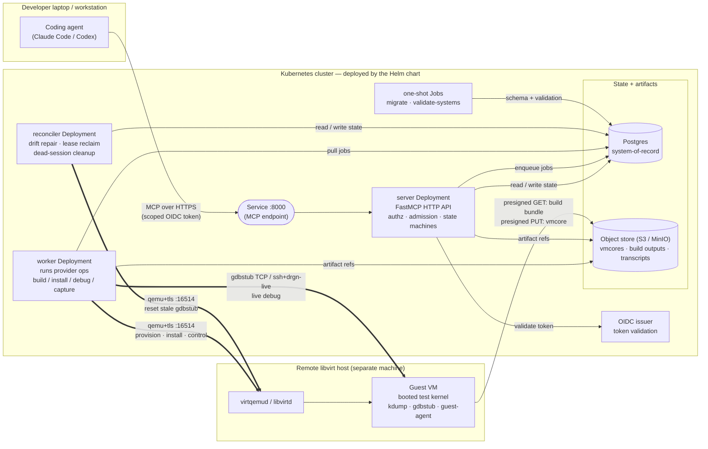
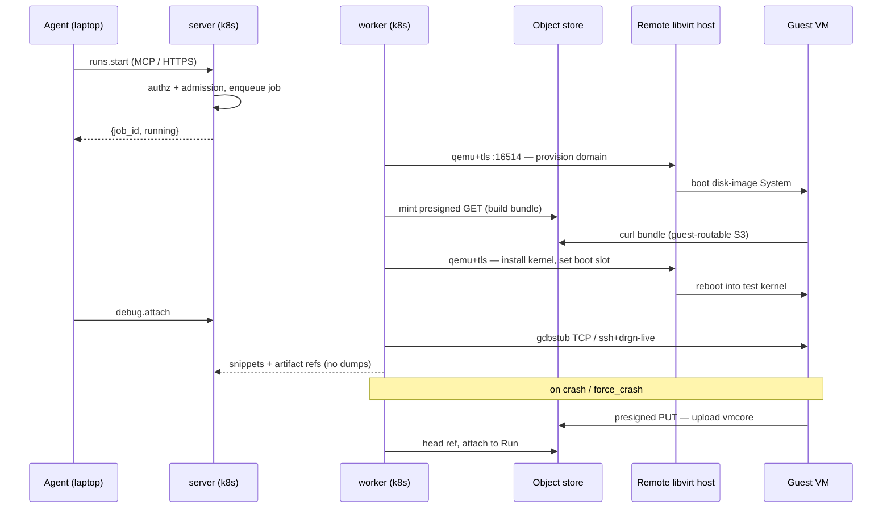

# KDIVE — Cluster architecture overview

A one-page picture of how KDIVE is deployed and how an agent on a developer's
laptop drives a kernel build → boot → debug cycle on a remote libvirt host.

KDIVE (Kernel Debug, Inspect, Validate, Explore) is an MCP service. It gives an
agentic coding environment (Claude Code, Codex, …) a full Linux-kernel lifecycle
across heterogeneous hardware. The Helm chart deploys the **control plane**; the
actual VMs run on a separate **remote-libvirt host**.

## The big picture

## What each component does

| Component | Helm object | Role |
|-----------|-------------|------|
| **server** | `deployment-server` + `service` (`:8000`) | The MCP HTTP API. Thin and fast: owns authz (OIDC/RBAC, on-behalf-of tokens), admission control (quota/budget/capacity), lifecycle state machines, and response shaping. Never blocks on a long operation — it enqueues a job and returns `{job_id, running}`. |
| **worker** | `deployment-worker` + `pvc-worker` (build 10Gi / install 5Gi) | Pulls durable jobs from the Postgres-backed queue and runs the actual provider operations (provision, build, install, debug-op, capture-vmcore). This is the only tier that opens long-lived connections to a remote host. |
| **reconciler** | `deployment-reconciler` | Periodic drift-repair loop: tears down orphaned Systems, reclaims expired leases, detaches dead debug sessions, and resets a dead worker's stale gdbstub. |
| **migrate / validate** | `job-migrate`, `job-validate-systems` | One-shot Jobs run at install/upgrade. `migrate` applies the DB schema; `validate-systems` fails the deploy fast if `systems.toml` is malformed. |
| **Postgres** | external, or bundled `demo/postgres` | System-of-record for all structured state: resources, allocations, systems, runs, the durable job queue, and the accounting/audit ledger. |
| **Object store (S3 / MinIO)** | external, or bundled `demo/minio` | Bulk artifacts — vmcores, build outputs, console/gdb transcripts. Postgres rows reference objects by key; output is never dumped through the API. |
| **OIDC issuer** | external, or bundled `demo/oidc` | Validates the agent's bearer token and supplies the RBAC claims the server enforces. |
| **ConfigMaps / Secret** | `configmap`, `systems`, `fixtures`, `secrets` | `configmap` carries `KDIVE_*` process env. The `systems` ConfigMap mounts `systems.toml` (the remote-host connection identity). The `secrets` mount projects the qemu+tls client cert/key — mounted only on server/worker/reconciler, the tiers that actually open the transport. |

The bundled Postgres/MinIO/OIDC (`demo/*` templates, gated behind
`bundledBackends: true` + `demoAcknowledged: true`) run on `emptyDir` and are for
demos only — a pod restart drops all state by design. Production points
`KDIVE_DATABASE_URL` / `KDIVE_S3_*` at operator-provided backends.

## How the cluster reaches a remote-libvirt system

The pods run no local `libvirtd` (`KDIVE_LOCAL_LIBVIRT_ENABLED=false`), so the
cluster is a pure control plane. It drives compute on a separate machine over
four independent channels:

**The four channels, and why they are separate:**

1. **`qemu+tls` (port 16514)** — the libvirt control channel. The worker provisions
   domains, installs kernels, sets the boot slot, and issues control ops (reboot,
   `injectNMI` for `force_crash`). TLS client cert/key come from the mounted Secret.
2. **gdbstub TCP** — live kernel debug. QEMU's gdbstub accepts one client; the
   worker attaches over the port published in the domain XML. The reconciler can
   reset a stale stub left by a dead worker.
3. **ssh → `drgn-live`** — an alternate live-introspection transport, authorized
   by a capability token and a profile-derived credential.
4. **Presigned S3** — bulk artifact movement that bypasses the cluster entirely:
   the **guest VM** pulls the build bundle (presigned GET) and pushes the vmcore
   (presigned PUT) directly to the object store. This is why the object-store
   endpoint must be reachable from the remote guest network, not just in-cluster.

The connection identity for the remote host — `qemu+tls` URI, TLS cert refs,
gdb address/port range, and base image — lives in `systems.toml`, mounted from a
ConfigMap. Adding a remote host is configuration, not a code change.
