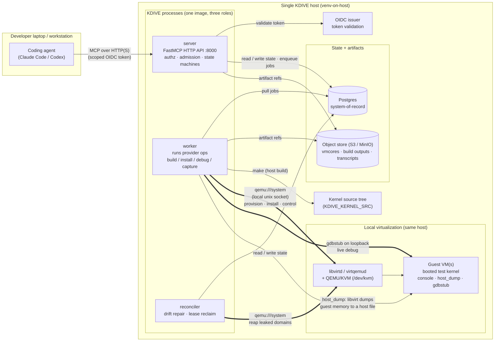
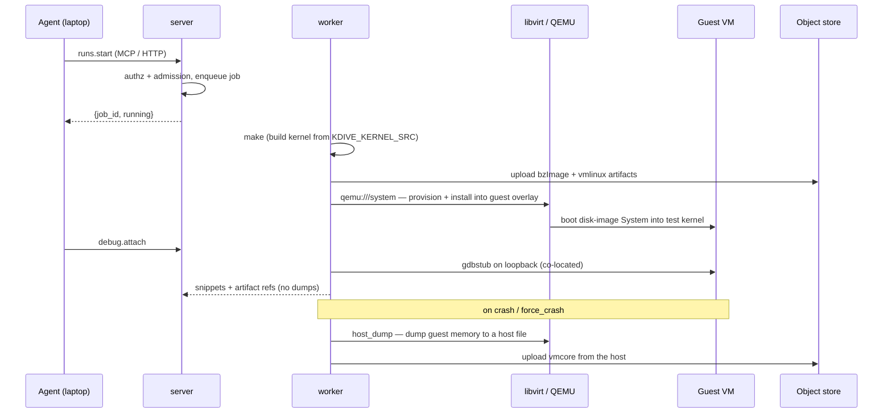

# KDIVE — Local-libvirt architecture overview

A one-page picture of KDIVE's **default** provider: build, boot, debug, and
crash-capture all running on a **single host**, driving QEMU/KVM guests through a
local libvirt socket.

This is the companion to the
[cluster (remote-libvirt) overview](cluster-architecture-overview.md). The two
share the same three processes and the same MCP API; what changes is *where the
compute lives*. With remote-libvirt the cluster is a control plane that drives a
separate machine; with **local-libvirt everything is on one host** — the worker,
the libvirt daemon, and the guest VMs are co-located, so the network hops collapse
into a local socket and the host filesystem.

## The big picture

## What each component does

| Component | Role |
|-----------|------|
| **server** | The MCP HTTP API. Thin and fast: owns authz (OIDC/RBAC, on-behalf-of tokens), admission control (quota/budget/capacity), lifecycle state machines, and response shaping. Enqueues a job and returns `{job_id, running}` rather than blocking. |
| **worker** | Pulls durable jobs from the Postgres-backed queue and runs the actual provider operations. On this provider it does everything *on the local host*: runs `make` against the kernel source, drives libvirt over the local socket, attaches the debugger over loopback, and captures cores. |
| **reconciler** | Periodic drift-repair loop: tears down orphaned Systems, reclaims expired leases, detaches dead debug sessions, and reaps leaked local domains. |
| **Postgres** | System-of-record for all structured state: resources, allocations, systems, runs, the durable job queue, and the accounting/audit ledger. |
| **Object store (S3 / MinIO)** | Bulk artifacts — vmcores, build outputs, console/gdb transcripts. Postgres rows reference objects by key; output is never dumped through the API. The worker uploads directly (here the guest never talks to S3 — see below). |
| **OIDC issuer** | Validates the agent's bearer token and supplies the RBAC claims the server enforces. |
| **Kernel source tree** | `KDIVE_KERNEL_SRC` — the tree the build path runs `make` against, producing the `bzImage` kernel and the `vmlinux` debuginfo. |
| **libvirtd / QEMU/KVM** | The local virtualization stack. The worker connects to `qemu:///system` (or `qemu:///session` unprivileged); `/dev/kvm` provides hardware acceleration. |
| **Guest VM(s)** | The provisioned, bootable Systems running the test kernel. Crash capture reads guest memory host-side. |

The host also needs the kernel-build toolchain (`make`, `gcc`/`binutils`, `flex`,
`bison`, `bc`, `git`, `rsync`, `xz`, and the `libssl`/`libelf` headers). On a
venv-on-host deployment the operator installs these; `just check-local-libvirt`
reports anything missing without changing the host.

## How the worker reaches a local system

Because the worker and the guest share one host, there is **no network transport,
no TLS, and no port `16514`** — the worker drives libvirt over a local unix socket
and moves artifacts through the host filesystem.

**The channels, and how they differ from remote:**

1. **`qemu:///system` (local unix socket)** — the libvirt control channel. The
   worker provisions domains, installs kernels into the guest overlay, and issues
   control ops. No certificates, no network hop — file-socket permissions are the
   access boundary.
2. **gdbstub on loopback** — live kernel debug. The stub and the worker are on the
   same host, so the debug connection never leaves `127.0.0.1`.
3. **Host filesystem for artifacts** — the build runs `make` locally and the
   worker uploads the `bzImage`/`vmlinux` straight to the object store; on a crash,
   libvirt dumps guest memory to a host file (`host_dump`) and the worker uploads
   it. The **guest never talks to the object store** — unlike remote-libvirt, there
   are no presigned URLs handed into the guest network.

**Crash-capture capability.** Local-libvirt advertises `{console, host_dump,
gdbstub}`. Remote-libvirt owns `{kdump}`. The two providers are complementary, not
redundant — each covers capture ground the other does not — which is why
local-libvirt stays the production default.

## Where this runs

Local-libvirt's natural home is **venv-on-host**: the three KDIVE processes run as
host processes alongside libvirt and KVM. The backends (Postgres, MinIO, OIDC) can
run on the same host via `docker compose` (`docker-compose.yml`).

It is **not** the Kubernetes path: a pod has no `libvirtd` socket or `/dev/kvm`, so
the Helm chart sets `KDIVE_LOCAL_LIBVIRT_ENABLED=false` (ADR-0127) and the cluster
drives a *remote* libvirt host instead. Use the
[cluster overview](cluster-architecture-overview.md) for that topology.

The [local-libvirt provider doc](../operating/providers/local-libvirt.md) and the
[live-stack runbook](../operating/runbooks/live-stack.md) cover the full bring-up
and a build → boot → verify cycle.
