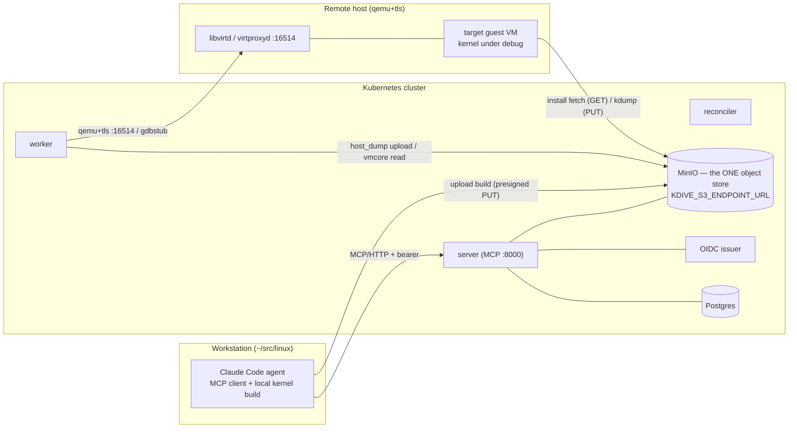

# Runbook: Kubernetes / Helm deployment

Operator guide for deploying the kdive control plane — `server`, `worker`, `reconciler`, plus a
migrate one-shot — on Kubernetes with the [Helm chart](../../../deploy/helm/kdive/README.md)
(ADR-0088). This is the **production-shaped** path; the
[live-stack runbook](live-stack.md) covers the source-tree (`just`) and `docker compose`
deployments. For driving the spine against a remote `qemu+tls://` libvirt host once the stack is
up, see [remote-live-stack.md](remote-live-stack.md).

It was written from a real microk8s bring-up; commands that are microk8s-specific are called out,
and the generic-cluster equivalent is given alongside.

## Prerequisites

- A Kubernetes cluster and `kubectl`/`helm` (v3) configured against it. Tested on microk8s
  v1.35; any conformant cluster works.
- A cluster that can pull from `ghcr.io` (the default registry). The chart defaults to
  `ghcr.io/randomparity/kdive`; `:edge` (rolling, from `main`) and signed `:X.Y.Z` release
  tags are published there. From a source checkout pin `--set image.tag=edge` (the default
  `appVersion` tag is unpublished until that version is cut), and **also pin
  `--set image.pullPolicy=Always`**: `:edge` is a mutable tag overwritten on every push to `main`,
  so with the chart default `IfNotPresent` a node that cached an older `edge` keeps serving it
  across `helm install`/`upgrade` — silently running stale code (the demo `values-demo.yaml` sets
  this for you). Only a fully offline cluster needs the build-and-load path in step 1.
- **External backends** the cluster can reach: Postgres, an S3-compatible object store
  (MinIO/AWS S3), and an OIDC issuer. For a throwaway demo instead, the first-party bundled-backend
  path (`-f deploy/helm/kdive/values-demo.yaml`, verified with `helm test`) stands up in-chart
  Postgres/MinIO/mock-OIDC on `emptyDir` — see the
  [chart README](../../../deploy/helm/kdive/README.md#bundled-backends-demo-only). It is `emptyDir`-only
  and **not** for anything you want to keep.
- A `StorageClass` for the worker's build/install PVCs (microk8s: `microk8s enable
  hostpath-storage`).

## 1. Build and push the image (offline-cluster fallback)

If your cluster can reach `ghcr.io`, skip this step: use the published image with `--set
image.tag=edge` (or a signed `:X.Y.Z`) and go to step 2. Only a fully offline/air-gapped cluster
needs to build its own — build from your checkout, tag by git SHA (not the static `appVersion`,
which is unpublished), and push to a registry the cluster pulls from.

```bash
SHA=$(git rev-parse --short=8 HEAD)
docker build -t <registry>/kdive:$SHA -f Dockerfile .
docker push <registry>/kdive:$SHA
```

**microk8s registry addon.** Enable it (`microk8s enable registry` → `localhost:32000` on the
node) and push over an SSH tunnel from your build host — Docker treats `localhost` as an insecure
registry with no daemon config:

```bash
ssh -fN -L 32000:localhost:32000 <node>          # tunnel the node's :32000 to your host
docker tag <registry>/kdive:$SHA localhost:32000/kdive:$SHA
docker push localhost:32000/kdive:$SHA           # in-cluster ref: localhost:32000/kdive:$SHA
```

Point the chart at the image with `--set image.repository=<registry>/kdive --set image.tag=$SHA`
(below). If you instead consume a **published, signed** release image, `cosign verify` it first —
see the [compose README](../../../deploy/compose/README.md#image-provenance--verify-before-you-run-a-published-image).

## 2. Stand up the external backends

Bring up Postgres, the object store, and the OIDC issuer however your environment provides them
(managed services, an in-cluster Postgres/MinIO you operate, etc.), and note the values the chart
needs (step 4). The object store needs a bucket (default `kdive-artifacts`). The migrate Job
(step 4) applies the schema against the Postgres you supply — the database must exist and be
reachable first.

> The object store reads its credentials from **boto3's default chain**
> (`AWS_ACCESS_KEY_ID` / `AWS_SECRET_ACCESS_KEY`), not from `KDIVE_S3_*`. Supply them as pod env
> (a Secret you `envFrom`, IRSA/workload identity, or — for a throwaway store — `config.AWS_*`,
> which the ConfigMap `range` emits). `KDIVE_S3_*` carries only the endpoint, bucket, and region.

## 3. Create the file-ref Secret (if using remote-libvirt or debug-session secrets)

The remote-libvirt TLS materials (and debug-session secrets) are resolved **by file** under
`KDIVE_SECRETS_ROOT`. Put them in a Kubernetes Secret whose keys are the credential filenames:

```bash
kubectl create secret generic kdive-remote-tls \
  --from-file=clientcert.pem=client.pem \
  --from-file=clientkey.pem=clientkey.pem \
  --from-file=cacert.pem=ca.pem
```

The chart projects it read-only and points the refs at it in step 4. You reference each key with
a **root-relative** ref (e.g. `clientcert.pem`) — the chart sets `KDIVE_SECRETS_ROOT` to the mount
path and the backend resolves refs under it (the Kubernetes Secret's `..data` symlink indirection
resolves correctly; a ref escaping the root is rejected). Skip this step if you are not deploying
remote-libvirt.

> **The Secret keys must match the `*_ref` filenames in your `systems.toml` exactly.** The keys
> above (`clientcert.pem`/`clientkey.pem`/`cacert.pem`) are only examples; the backend looks up
> each ref by its literal filename. If your inventory says `client_cert_ref = "remote-clientcert.pem"`,
> the Secret key must be `remote-clientcert.pem` — a mismatch fails ref resolution at provision time,
> not at install, so the host registers but never connects.

## 4. Install the chart

```bash
helm install kdive deploy/helm/kdive \
  --set image.repository=localhost:32000/kdive --set image.tag=$SHA \
  --set config.KDIVE_DATABASE_URL='postgresql://kdive:<pw>@<pg-host>:5432/kdive' \
  --set config.KDIVE_OIDC_ISSUER='https://idp.example/realms/kdive' \
  --set config.KDIVE_OIDC_JWKS_URI='https://idp.example/realms/kdive/protocol/openid-connect/certs' \
  --set config.KDIVE_S3_ENDPOINT_URL='https://s3.example' \
  --set secrets.secretName=kdive-remote-tls
```

To enable the remote-libvirt provider, declare a `[[remote_libvirt]]` instance in the mounted
`systems.toml` ConfigMap (`KDIVE_SYSTEMS_TOML`) — uri, gdb addr, gdbstub range, and the TLS
cert/key/CA refs live there now, not in `config.KDIVE_REMOTE_LIBVIRT_*` (#395). See the
remote-libvirt host-setup runbook for the instance block.

### Upgrading a release (config-default drift — ADR-0134)

**Do not upgrade with bare `helm upgrade --reuse-values`.** `--reuse-values` carries the previous
release's merged values and *ignores the new chart's `values.yaml` defaults*, so a config default
added in a later chart (e.g. `config.KDIVE_LOCAL_LIBVIRT_ENABLED: "false"`, ADR-0127) never reaches
an already-installed release — the new image then runs without it (the local-libvirt reaper
crash-loops on a pod with no libvirt socket). Capture your current overrides and re-apply them on
top of the fresh defaults instead:

```bash
helm get values kdive -o yaml > kdive-values.yaml   # your overrides only (no chart defaults)
helm upgrade kdive deploy/helm/kdive -f kdive-values.yaml --set image.tag=$SHA
```

`-f kdive-values.yaml` preserves your overrides **and** layers the new chart's defaults on top, so
a new config default is not dropped. As a backstop the chart renders
`KDIVE_LOCAL_LIBVIRT_ENABLED` from a defensive `default "false"`, so even a bare `--reuse-values`
no longer reintroduces that crash-loop — but `-f kdive-values.yaml` is the general fix for *any*
future config-default drift, so prefer it.

### Deploy-time Jobs: validate, migrate, seed (ADR-0121)

A `helm upgrade` runs three single-responsibility Jobs, so each failure names exactly what broke
(a "migrate" failure is never a config or object-store fault):

| Job | Hook phase | Fails when |
|-----|-----------|------------|
| `<release>-kdive-validate-systems` | `pre-install`/`pre-upgrade`, weight `-10` | the mounted `systems.toml` is malformed/invalid (fail-fast — aborts the upgrade before migrate) |
| `<release>-kdive-migrate` | `pre-*` external / `post-*` bundled, weight `0` | a SQL schema migration actually fails |
| `<release>-kdive-seed-build-configs` | `post-install`/`post-upgrade`, weight `10` | the object store is unreachable/misconfigured (runs after the app rolls out) |

The validate Job renders only when `systems.configMapName` is set. Migrations are forward-only and
must be backward-compatible (ADR-0015), so a rollback is image-only.

**Validate `systems.toml` against the running image (no DB/S3 needed):**

```bash
# Against a live deploy, the precise field error is in the hook pod's logs (Helm reports only
# "pre-upgrade hooks failed"). Read it BEFORE retrying — the before-hook-creation policy reaps
# the failed pod on the next upgrade attempt:
kubectl logs job/<release>-kdive-validate-systems

# Or validate a candidate ConfigMap ad hoc with only the image + kubectl:
kubectl run kdive-validate --rm -i --restart=Never --image=<your kdive image> \
  --overrides='{"spec":{"volumes":[{"name":"s","configMap":{"name":"<your systems ConfigMap>"}}],
    "containers":[{"name":"v","image":"<your kdive image>","args":["reconcile-systems","--check","--path","/s/systems.toml"],
    "volumeMounts":[{"name":"s","mountPath":"/s"}]}]}}'
```

**Failure policy.** A malformed `systems.toml` aborts the upgrade at deploy time (fail-fast); the
running reconciler instead degrades (keep-last-good) on a bad file — different moments, by design
(ADR-0121). **ConfigMap preconditions:** `systems.configMapName` must name an existing ConfigMap
whose key equals `systems.fileName` (default `systems.toml`); a missing ConfigMap leaves the hook
pod in `CreateContainerConfigError`. **Seed recovery:** if `seed-build-configs` fails, fix the
object store, then re-run `helm upgrade` (re-fires the hook) or run `python -m kdive
seed-build-configs` in a pod carrying the config ConfigMap env.

Watch the rollout:

```bash
kubectl rollout status deploy/kdive-kdive-server
kubectl get pods -l app.kubernetes.io/name=kdive
```

> **Updating config after install.** `config.*` renders into a ConfigMap the pods read **once**
> via `envFrom` at start. A `helm upgrade` that changes a `config.*` value now rolls the
> server/worker/reconciler automatically — their pod templates carry a `checksum/config`
> annotation (ADR-0134) that changes with the ConfigMap, so the rollout picks up the new values
> with no manual `kubectl rollout restart`. The bundled Postgres/MinIO backends carry no such
> annotation, so a config change never rolls their `emptyDir` pods (which would wipe demo data).
> The external-path ConfigMap is also a pre-upgrade hook, so `helm upgrade --no-hooks` **skips**
> it — use a hooked upgrade for config changes.

## 5. Reach the MCP endpoint

The chart's only Service fronts the server's MCP port `8000` as a **ClusterIP** (the per-process
`/livez`/`/readyz`/`/metrics` aux ports are deliberately pod-local and not exposed). To reach MCP
from outside the cluster, either port-forward:

```bash
kubectl port-forward svc/kdive-kdive-server 8000:8000
# MCP at http://127.0.0.1:8000/mcp
```

…or expose it for a longer-lived setup with `service.type` (or front it with an
Ingress/LoadBalancer). Set it at install/upgrade — optionally pinning the port:

```bash
helm get values kdive -o yaml > kdive-values.yaml   # capture overrides (not --reuse-values; see Upgrade)
helm upgrade kdive deploy/helm/kdive -f kdive-values.yaml \
  --set service.type=NodePort --set service.nodePort=30800
kubectl get svc kdive-kdive-server -o jsonpath='{.spec.ports[0].nodePort}'
# MCP at http://<node-ip>:<nodePort>/mcp
```

Leave `service.nodePort` unset to let the cluster assign one.

FastMCP serves at **`/mcp`** — a bare host returns a 307/session error, so any client base URL
must end in `/mcp`.

## 6. Verify

Each Deployment carries a readiness probe against its `/readyz` aux endpoint, so the kubelet
already evaluates health — a `Ready` pod has a passing `/readyz` (its backend set: DB, object
store, OIDC). A pod stuck `0/1 Running` is failing readiness; `kubectl describe pod` shows which
backend, which you fix via the corresponding `config.*`/Secret.

```bash
# Ready = /readyz green (the aux listener is pod-local, not fronted by a Service):
kubectl get pods -l app.kubernetes.io/name=kdive

# An authenticated MCP call (needs a token from your OIDC issuer with audience `kdive`):
curl -s -H "Authorization: Bearer $TOKEN" \
  -H 'Content-Type: application/json' \
  -d '{"jsonrpc":"2.0","id":1,"method":"tools/list"}' \
  http://<mcp-host>/mcp | head
```

### Collect metrics (opt-in — ADR-0189)

The per-process `/metrics` (ADR-0090 §5) are emitted but not collected by default. Install with
`--set bundledObservability=true` to deploy an in-cluster Prometheus that scrapes all three
components via the `prometheus.io/scrape` annotations. This is the live check the render tests
cannot do — confirm every component is an `UP` target and the `kdive_*` series are present:

```bash
kubectl port-forward svc/<release>-kdive-prometheus 9090:9090
# http://localhost:9090/targets — server/worker/reconciler all UP
# http://localhost:9090/graph — query kdive_job_queue_depth (worker) / kdive_mcp_requests (server)
```

It is off by default (production is BYO — the chart README documents a `PodMonitor` for
Operator clusters and the existing-Prometheus annotation path), runs on `emptyDir` with short
retention, and its Service is `9090`-only (the aux `/metrics` is never re-exposed off-cluster).

## 7. Architecture: one object store, three consumers

There is exactly **one** object store (S3/MinIO) in a deployment, and **three different parties
read and write it** over presigned URLs whose host is `KDIVE_S3_ENDPOINT_URL`: the in-cluster
**worker**, an **external uploader** (an agent that built a kernel locally and uploads it via
`runs.complete_build`), and the **remote-libvirt guest** (which `curl`s the kernel bundle on
`install` and PUTs a vmcore on `kdump` capture). A presigned URL embeds the endpoint host, so that
one value must resolve to the same store *over a network path each party can reach*.



The OIDC issuer is bound the same way (into a token's `iss`), but only the pods and the MCP client
need it — the guest does not. The object store is the harder constraint because **all three**
parties touch it.

### The bundled demo's object store is in-cluster only — expose it for remote-libvirt

`bundledBackends=true` runs MinIO as a **ClusterIP** Service and forces
`KDIVE_S3_ENDPOINT_URL=http://<release>-minio:9000` — a name only in-cluster pods resolve. With
that default, `host_dump` capture and `introspect.from_vmcore` work (worker-side, in-cluster), but
**external uploads and any remote-libvirt `install`/`kdump` capture fail**: the uploader and the
guest cannot reach a cluster-internal name. To use the bundled store off-cluster, expose it and
point the endpoint at a node-routable address all three parties reach:

```bash
helm get values kdive -o yaml > kdive-values.yaml   # capture overrides (not --reuse-values; see Upgrade)
helm upgrade kdive deploy/helm/kdive \
  -f deploy/helm/kdive/values-demo.yaml -f kdive-values.yaml \
  --set demo.minio.service.type=NodePort --set demo.minio.service.nodePort=30900 \
  --set config.KDIVE_S3_ENDPOINT_URL=http://<node-ip>:30900
# The endpoint change rolls server/worker/reconciler automatically (checksum/config, ADR-0134);
# no manual rollout restart — and never `rollout restart -l app.kubernetes.io/name=kdive`, whose
# selector also restarts the emptyDir Postgres/MinIO and wipes demo data.
```

> **The cluster network/firewall must permit this.** A locked-down cluster that only admits the
> API port (`:6443`) and blocks the NodePort range (and Traefik's `:80/:443`) cannot expose the
> store this way — the worker→guest debug lifecycle then needs either a firewall change on the
> nodes or an **external** S3 endpoint that the pods, the uploader, and the guest all reach
> (e.g. a MinIO/S3 on a host on a shared network). `host_dump`-only capture of the base-image
> kernel still works without any of this.

If you expose OIDC similarly, set `config.KDIVE_OIDC_ISSUER` to the externally routable URL too —
again, not a cluster-internal name only the pods resolve.

## 8. Remote-libvirt host prerequisites

Deploying remote-libvirt also requires the operator-side setup the
[remote-live-stack runbook](remote-live-stack.md) covers: worker→host mutual TLS, the gdbstub-port
ACL, object-store reachability from the guest, and an operator-staged base-OS image on the host's
storage pool. Those are host-side obligations independent of this chart install.

## 9. Teardown

Helm releases are **namespace-scoped**, and `helm uninstall` only acts on one namespace. If you
installed into a non-default namespace (the bundled demo is commonly installed with `-n
kdive-demo`), a bare `helm uninstall kdive` fails with `Release not loaded` — it queries your
kubeconfig context's default namespace, not the release's. Target the install namespace explicitly
(`helm list -A` shows where each release actually lives), and substitute it for `<ns>` below:

```bash
helm uninstall kdive -n <ns>
kubectl delete pvc -l app.kubernetes.io/name=kdive -n <ns>   # PVCs are not removed by uninstall
kubectl delete secret kdive-remote-tls -n <ns>               # if created in step 3
```

`helm uninstall` does **not** garbage-collect the chart's hook resources (the migrate /
validate-systems / seed-build-configs hook Jobs, the `helm test` smoke pod, and the `systems.toml`
ConfigMap) — `before-hook-creation` only deletes a hook before the *next* install creates it, so
completed hook objects linger after uninstall. Remove them:

```bash
kubectl delete job kdive-kdive-migrate kdive-kdive-validate-systems kdive-kdive-seed-build-configs -n <ns>
kubectl delete pod kdive-kdive-smoke -n <ns>
kubectl delete configmap kdive-systems -n <ns>
```

The external backends you stood up in step 2 are uninstalled separately.
