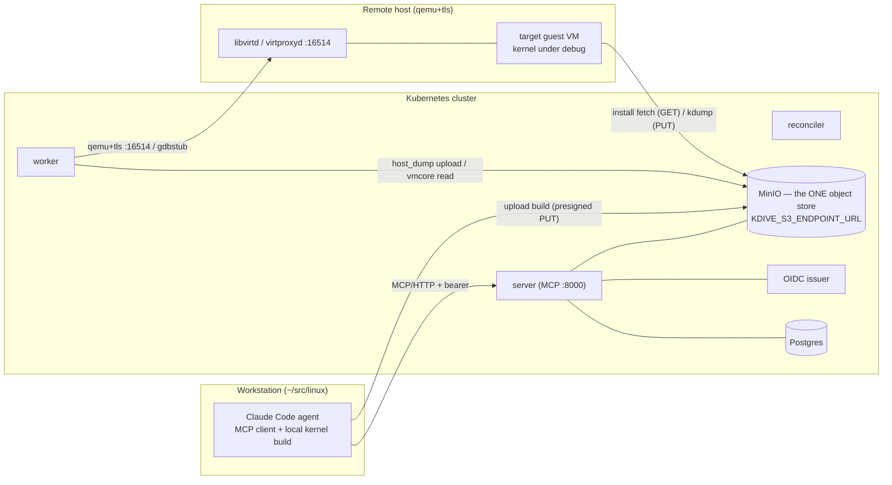

# Runbook: Kubernetes / Helm deployment

Operator guide for deploying the kdive control plane — `server`, `worker`, `reconciler`, and the
dedicated `lifecycle-witness`, plus a migrate one-shot — on Kubernetes with the
[Helm chart](../../../deploy/helm/kdive/README.md)
(ADR-0088). This is the **production-shaped** path; the
[live-stack runbook](live-stack.md) covers the source-tree (`just`) and `docker compose`
deployments. For driving the spine against a remote `qemu+tls://` libvirt host once the stack is
up, see [remote-live-stack.md](remote-live-stack.md).

It was written from a real microk8s bring-up; commands that are microk8s-specific are called out,
and the generic-cluster equivalent is given alongside.

## Prerequisites

- A Kubernetes cluster and `kubectl`/`helm` (v3) configured against it. Tested on microk8s
  v1.35; any conformant cluster works.
- A cluster that can pull from `ghcr.io` (the default registry). The chart defaults to
  `ghcr.io/randomparity/kdive`; `:edge` (rolling, from `main`) and signed `:X.Y.Z` release
  tags are published there. From a source checkout pin `--set image.tag=edge` (the default
  `appVersion` tag is unpublished until that version is cut), and **also pin
  `--set image.pullPolicy=Always`**: `:edge` is a mutable tag overwritten on every push to `main`,
  so with the chart default `IfNotPresent` a node that cached an older `edge` keeps serving it
  across `helm install`/`upgrade` — silently running stale code (the demo `values-demo.yaml` sets
  this for you). Only a fully offline cluster needs the build-and-load path in step 1.
- **External backends** the cluster can reach: Postgres, an S3-compatible object store
  (MinIO/AWS S3), and an OIDC issuer. For a throwaway demo instead, the first-party bundled-backend
  path (`-f deploy/helm/kdive/values-demo.yaml`, verified with `helm test`) stands up in-chart
  Postgres/MinIO/mock-OIDC on `emptyDir` — see the
  [chart README](../../../deploy/helm/kdive/README.md#bundled-backends-demo-only). It is `emptyDir`-only
  and **not** for anything you want to keep.
- A `StorageClass` for the worker's build/install PVCs (microk8s: `microk8s enable
  hostpath-storage`).

## 1. Build and push the image (offline-cluster fallback)

If your cluster can reach `ghcr.io`, skip this step: use the published image with `--set
image.tag=edge` (or a signed `:X.Y.Z`) and go to step 2. Only a fully offline/air-gapped cluster
needs to build its own — build from your checkout, tag by git SHA (not the static `appVersion`,
which is unpublished), and push to a registry the cluster pulls from.

```bash
SHA=$(git rev-parse --short=8 HEAD)
docker build -t <registry>/kdive:$SHA -f Dockerfile .
docker push <registry>/kdive:$SHA
```

**microk8s registry addon.** Enable it (`microk8s enable registry` → `localhost:32000` on the
node) and push over an SSH tunnel from your build host — Docker treats `localhost` as an insecure
registry with no daemon config:

```bash
ssh -fN -L 32000:localhost:32000 <node>          # tunnel the node's :32000 to your host
docker tag <registry>/kdive:$SHA localhost:32000/kdive:$SHA
docker push localhost:32000/kdive:$SHA           # in-cluster ref: localhost:32000/kdive:$SHA
```

Point the chart at the image with `--set image.repository=<registry>/kdive --set image.tag=$SHA`
(below). If you instead consume a **published, signed** release image, `cosign verify` it first —
see the [compose README](../../../deploy/compose/README.md#image-provenance--verify-before-you-run-a-published-image).

## 2. Stand up the external backends

Bring up Postgres, the object store, and the OIDC issuer however your environment provides them
(managed services, an in-cluster Postgres/MinIO you operate, etc.), and note the values the chart
needs (step 4). The object store needs a bucket (default `kdive-artifacts`). The migrate Job
(step 4) applies the schema against the Postgres you supply — the database must exist and be
reachable first.

> The object store reads its credentials from **boto3's default chain**
> (`AWS_ACCESS_KEY_ID` / `AWS_SECRET_ACCESS_KEY`), not from `KDIVE_S3_*`. Supply them as pod env
> (a Secret you `envFrom`, IRSA/workload identity, or — for a throwaway store — `config.AWS_*`,
> which the ConfigMap `range` emits). `KDIVE_S3_*` carries only the endpoint, bucket, and region.

## 3. Create the file-ref Secret (if using remote-libvirt or debug-session secrets)

The remote-libvirt TLS materials (and debug-session secrets) are resolved **by file** under
`KDIVE_SECRETS_ROOT`. Put them in a Kubernetes Secret whose keys are the credential filenames:

```bash
kubectl create secret generic kdive-remote-tls \
  --from-file=clientcert.pem=client.pem \
  --from-file=clientkey.pem=clientkey.pem \
  --from-file=cacert.pem=ca.pem
```

The chart projects it read-only and points the refs at it in step 4. You reference each key with
a **root-relative** ref (e.g. `clientcert.pem`) — the chart sets `KDIVE_SECRETS_ROOT` to the mount
path and the backend resolves refs under it (the Kubernetes Secret's `..data` symlink indirection
resolves correctly; a ref escaping the root is rejected). Skip this step if you are not deploying
remote-libvirt.

> **The Secret keys must match the `*_ref` filenames in your `systems.toml` exactly.** The keys
> above (`clientcert.pem`/`clientkey.pem`/`cacert.pem`) are only examples; the backend looks up
> each ref by its literal filename. If your inventory says `client_cert_ref = "remote-clientcert.pem"`,
> the Secret key must be `remote-clientcert.pem` — a mismatch fails ref resolution at provision time,
> not at install, so the host registers but never connects.

## 4. Install the chart

Before install, create separate database login principals and a Secret containing the migration,
server, worker, reconciler, and lifecycle-witness DSNs. The capability-role names and required
membership shape are documented in the chart README. The examples use the chart's default Secret
name and keys; production may use separate Secrets by overriding each `databaseCredentials.*` ref.
The chart deploys the witness separately from the reconciler so neither process receives the
other's database principal or authority-bearing Secret mounts.

```bash
kubectl create secret generic kdive-database \
  --from-file=migration-dsn=./migration.dsn \
  --from-file=server-dsn=./server.dsn \
  --from-file=worker-dsn=./worker.dsn \
  --from-file=reconciler-dsn=./reconciler.dsn \
  --from-file=lifecycle-witness-dsn=./lifecycle-witness.dsn
```

```bash
helm install kdive deploy/helm/kdive \
  --set image.repository=localhost:32000/kdive --set image.tag=$SHA \
  --set config.KDIVE_OIDC_ISSUER='https://idp.example/realms/kdive' \
  --set config.KDIVE_OIDC_JWKS_URI='https://idp.example/realms/kdive/protocol/openid-connect/certs' \
  --set config.KDIVE_S3_ENDPOINT_URL='https://s3.example' \
  --set secrets.secretName=kdive-remote-tls
```

To enable the remote-libvirt provider, declare a `[[remote_libvirt]]` instance in the mounted
`systems.toml` ConfigMap (`KDIVE_SYSTEMS_TOML`) — uri, gdb addr, gdbstub range, and the TLS
cert/key/CA refs live there now, not in `config.KDIVE_REMOTE_LIBVIRT_*` (#395). See the
remote-libvirt host-setup runbook for the instance block.

### Upgrading a release (config-default drift — ADR-0134)

**Do not upgrade with bare `helm upgrade --reuse-values`.** `--reuse-values` carries the previous
release's merged values and *ignores the new chart's `values.yaml` defaults*, so a config default
added in a later chart (e.g. `config.KDIVE_LOCAL_LIBVIRT_ENABLED: "false"`, ADR-0127) never reaches
an already-installed release — the new image then runs without it (the local-libvirt reaper
crash-loops on a pod with no libvirt socket). Capture your current overrides and re-apply them on
top of the fresh defaults instead:

```bash
helm get values kdive -o yaml > kdive-values.yaml   # your overrides only (no chart defaults)
helm upgrade kdive deploy/helm/kdive -f kdive-values.yaml --set image.tag=$SHA
```

`-f kdive-values.yaml` preserves your overrides **and** layers the new chart's defaults on top, so
a new config default is not dropped. As a backstop the chart renders
`KDIVE_LOCAL_LIBVIRT_ENABLED` from a defensive `default "false"`, so even a bare `--reuse-values`
no longer reintroduces that crash-loop — but `-f kdive-values.yaml` is the general fix for *any*
future config-default drift, so prefer it.

### Deploy-time Jobs: validate and migrate

A `helm upgrade` runs single-responsibility Jobs, so each failure names exactly what broke
(a "migrate" failure is never a config or object-store fault):

| Job | Hook phase | Fails when |
|-----|-----------|------------|
| `<release>-kdive-validate-systems` | `pre-install`/`pre-upgrade`, weight `-10` | the mounted `systems.toml` is malformed/invalid (fail-fast — aborts the upgrade before migrate) |
| `<release>-kdive-migrate` | `pre-*` external; `post-install` and `pre-upgrade` bundled, weight `0` | a SQL schema migration actually fails |

The validate Job renders only when `systems.configMapName` is set. Protocol 4 is a build-new-only
exception to the ordinary migration policy: migration 0113 requires fresh resources as described
below.

### Staged worker-fence upgrade

#### Capture publication protocol 4 (migration 0113)

Protocol 4 has no Kubernetes upgrade or cutover path. Install this release into a new empty
Postgres database and a new versioned object-store bucket or namespace. Migration 0113 refuses
existing worker, job, capture-operation, or artifact rows. KDIVE does not migrate, preserve,
inspect, or clean protocol-3 data or objects.

Use the chart's ordinary fresh-install path with those resources. The bundled install keeps worker
replicas at zero until migration completes. Each worker then performs the live conditional-create
probe before readiness and job claims. If the probe fails, correct the bucket's versioning or
conditional-create behavior and restart the worker; do not route around the admission check.

The remaining staged procedure applies to other worker-fence releases.

Use this procedure for a release carrying the worker-fence protocol. It is stop-old-first and
forward-only: do not restore an old worker image, force-delete a Pod, remove a finalizer, or
suppress an error. All Helm stages use private, digest-addressed snapshots of the same target chart
and values plus the same rendered image. The mutable operator inputs are drift checks only after
Stage 1; Helm never reads them. Do not use `--reuse-values`, `--atomic`, or a rollback.

#### Stage 1 — Capture restartable recovery state

Set the namespace explicitly. The release and repository chart path default to the reference
names, but may be overridden in the environment. Run every block in Bash from the repository root.
For a new attempt, capture the current overrides into a new restricted target-values file:

```bash
set -euo pipefail
umask 077
: "${NAMESPACE:?set the target namespace}"
RELEASE=${RELEASE:-kdive}
CHART=${CHART:-deploy/helm/kdive}
TARGET_VALUES=${TARGET_VALUES:-kdive-target-values.yaml}
RECOVERY_STATE_FILE=${RECOVERY_STATE_FILE:-${RELEASE}-fence-upgrade.state}
RECOVERY_CHART_DIR="${RECOVERY_STATE_FILE}.charts"
RECOVERY_VALUES_DIR="${RECOVERY_STATE_FILE}.values"
TARGET_VALUES_TMP="${TARGET_VALUES}.tmp"
RECOVERY_STATE_TMP="${RECOVERY_STATE_FILE}.tmp"
COMPLETED_STATE="${RECOVERY_STATE_FILE}.complete"
FULL="${RELEASE}-kdive"
RECOVERY_STATE="${FULL}-fence-upgrade"
QUEUE_STATE_JOB="${FULL}-fence-queue-state"
DB_CLIENT_JOB="${FULL}-fence-db-check"
INCARNATION_JOB="${FULL}-fence-worker-check"

validate_short_name() {
  local name=$1
  case "$name" in
    "" | *[!a-z0-9-]* | -* | *-)
      echo "invalid generated Kubernetes name: $name" >&2
      exit 2
      ;;
  esac
  test "${#name}" -le 63 || {
    echo "generated Kubernetes name exceeds 63 characters: $name" >&2
    exit 2
  }
}

for name in "$RECOVERY_STATE" "$QUEUE_STATE_JOB" "$DB_CLIENT_JOB" "$INCARNATION_JOB"; do
  validate_short_name "$name"
done
test ! -e "$TARGET_VALUES" || {
  echo "target values already exist: $TARGET_VALUES; do not overwrite them" >&2
  exit 2
}
for path in "$TARGET_VALUES_TMP" "$RECOVERY_STATE_FILE" "$RECOVERY_STATE_TMP" \
  "$COMPLETED_STATE"; do
  test ! -e "$path" || {
    echo "recovery artifact already exists: $path; inspect it before retrying" >&2
    exit 2
  }
done

helm get values "$RELEASE" -n "$NAMESPACE" -o yaml >"$TARGET_VALUES_TMP"
chmod 0600 "$TARGET_VALUES_TMP"
mv -- "$TARGET_VALUES_TMP" "$TARGET_VALUES"
test "$(stat -c '%a' "$TARGET_VALUES")" = 600 || {
  echo "target values are not mode 0600: $TARGET_VALUES" >&2
  exit 2
}
```

Edit this one target file now to select the target image and configuration, then run
`chmod 0600 "$TARGET_VALUES"`. Once the next block pins it, use the repin path below for any
change. The next block renders that edited
file before any workload scale, extracts only the target migration Job's image and
`KDIVE_DATABASE_URL` Secret reference, captures the live counts and queue state, and publishes the
local record atomically before creating the cluster record. It never reads, stores, or prints a
Secret value. If a diagnostic Job from an interrupted attempt exists, inspect its failed logs first,
then set `RETRY_DIAGNOSTIC=1`; the retry deletes only that exact Job.

```bash
set -euo pipefail
umask 077
: "${NAMESPACE:?set the target namespace}"
RELEASE=${RELEASE:-kdive}
CHART=${CHART:-deploy/helm/kdive}
TARGET_VALUES=${TARGET_VALUES:-kdive-target-values.yaml}
RECOVERY_STATE_FILE=${RECOVERY_STATE_FILE:-${RELEASE}-fence-upgrade.state}
RECOVERY_CHART_DIR="${RECOVERY_STATE_FILE}.charts"
RECOVERY_VALUES_DIR="${RECOVERY_STATE_FILE}.values"
TARGET_VALUES_TMP="${TARGET_VALUES}.tmp"
RECOVERY_STATE_TMP="${RECOVERY_STATE_FILE}.tmp"
COMPLETED_STATE="${RECOVERY_STATE_FILE}.complete"
FULL="${RELEASE}-kdive"
RECOVERY_STATE="${FULL}-fence-upgrade"
QUEUE_STATE_JOB="${FULL}-fence-queue-state"
DB_CLIENT_JOB="${FULL}-fence-db-check"
INCARNATION_JOB="${FULL}-fence-worker-check"
RETRY_DIAGNOSTIC="${RETRY_DIAGNOSTIC:-}"

validate_nonnegative_count() {
  case "$1" in
    "" | *[!0-9]*)
      echo "invalid live replica count: $1" >&2
      exit 2
      ;;
  esac
}

validate_short_name() {
  local name=$1
  case "$name" in
    "" | *[!a-z0-9-]* | -* | *-)
      echo "invalid generated Kubernetes name: $name" >&2
      exit 2
      ;;
  esac
  test "${#name}" -le 63 || {
    echo "generated Kubernetes name exceeds 63 characters: $name" >&2
    exit 2
  }
}

validate_secret_name() {
  local name=$1 label
  local -a labels
  test "${#name}" -le 253 || {
    echo "migration Secret name exceeds 253 characters: $name" >&2
    exit 2
  }
  case "$name" in
    "" | *[!a-z0-9.-]* | [!a-z0-9]* | *[!a-z0-9])
      echo "invalid migration Secret DNS-subdomain name: $name" >&2
      exit 2
      ;;
  esac
  IFS=. read -r -a labels <<<"$name"
  for label in "${labels[@]}"; do
    case "$label" in
      "" | *[!a-z0-9-]* | [!a-z0-9]* | *[!a-z0-9])
        echo "invalid migration Secret DNS label in: $name" >&2
        exit 2
        ;;
    esac
    test "${#label}" -le 63 || {
      echo "migration Secret DNS label exceeds 63 characters: $name" >&2
      exit 2
    }
  done
}

validate_secret_key() {
  local key=$1
  test "${#key}" -le 253 || {
    echo "migration Secret key exceeds 253 characters: $key" >&2
    exit 2
  }
  case "$key" in
    "" | *[!A-Za-z0-9._-]*)
      echo "invalid migration Secret data key: $key" >&2
      exit 2
      ;;
  esac
}

validate_pull_policy() {
  case "$1" in
    Always | IfNotPresent | Never) ;;
    *)
      echo "invalid target migration imagePullPolicy: $1" >&2
      exit 2
      ;;
  esac
}

validate_sha256() {
  test "${#1}" -eq 64 || {
    echo "invalid SHA-256 length for $2" >&2
    exit 2
  }
  case "$1" in
    *[!0-9a-f]*)
      echo "invalid SHA-256 characters for $2" >&2
      exit 2
      ;;
  esac
}

sha256_file() {
  local output
  test -f "$1" && test ! -L "$1" || {
    echo "expected a regular non-symlink file: $1" >&2
    exit 2
  }
  output=$(sha256sum -- "$1")
  printf '%s\n' "${output%% *}"
}

sha256_chart() (
  set -euo pipefail
  umask 077
  local chart=$1 listing= sorted= manifest= path output status temporary
  cleanup_chart_hash() {
    status=$?
    trap - EXIT
    for temporary in "$listing" "$sorted" "$manifest"; do
      test -z "$temporary" || rm -f -- "$temporary"
    done
    exit "$status"
  }
  trap cleanup_chart_hash EXIT
  listing=$(mktemp "${TMPDIR:-/tmp}/kdive-chart-list.XXXXXX")
  sorted=$(mktemp "${TMPDIR:-/tmp}/kdive-chart-sort.XXXXXX")
  manifest=$(mktemp "${TMPDIR:-/tmp}/kdive-chart-manifest.XXXXXX")
  chmod 0600 "$listing" "$sorted" "$manifest"

  if test -f "$chart" && test ! -L "$chart"; then
    sha256_file "$chart"
    exit 0
  fi
  test -d "$chart" && test ! -L "$chart" || {
    echo "chart must be a local directory or regular packaged-chart file: $chart" >&2
    exit 2
  }
  if (cd -- "$chart" && find -P . \( ! -type d ! -type f \) -print -quit) |
    IFS= read -r _; then
    echo "chart contains a non-regular entry: $chart" >&2
    exit 2
  fi
  (cd -- "$chart" && find -P . -type f -print0 >"$listing")
  LC_ALL=C sort -z "$listing" >"$sorted"
  : >"$manifest"
  while IFS= read -r -d '' path; do
    (
      cd -- "$chart"
      output=$(sha256sum -- "$path")
      printf 'F\0%s\0%s\0' "$path" "${output%% *}"
    ) >>"$manifest"
  done <"$sorted"
  sha256_file "$manifest"
)

publish_chart_snapshot() (
  set -euo pipefail
  local chart=$1 digest=$2 suffix target temporary= actual status
  cleanup_snapshot_publish() {
    status=$?
    trap - EXIT
    if test -n "$temporary" && ! rm -r -- "$temporary"; then
      echo "failed to remove chart snapshot temporary: $temporary" >&2
      test "$status" -ne 0 || status=1
    fi
    exit "$status"
  }
  trap cleanup_snapshot_publish EXIT
  test ! -L "$RECOVERY_CHART_DIR" || {
    echo "recovery chart directory must not be a symlink: $RECOVERY_CHART_DIR" >&2
    exit 2
  }
  if test ! -e "$RECOVERY_CHART_DIR"; then
    mkdir -- "$RECOVERY_CHART_DIR"
  fi
  test -d "$RECOVERY_CHART_DIR" || {
    echo "recovery chart path is not a directory: $RECOVERY_CHART_DIR" >&2
    exit 2
  }
  chmod 0700 "$RECOVERY_CHART_DIR"
  if test -d "$chart" && test ! -L "$chart"; then
    suffix=dir
  elif test -f "$chart" && test ! -L "$chart"; then
    suffix=tgz
  else
    echo "chart must be a local directory or regular packaged-chart file: $chart" >&2
    exit 2
  fi
  target="${RECOVERY_CHART_DIR}/${digest}.${suffix}"
  if test -e "$target"; then
    actual=$(sha256_chart "$target")
    test "$actual" = "$digest" || {
      echo "existing chart snapshot hash mismatch: $target" >&2
      exit 2
    }
    printf '%s\n' "$target"
    exit 0
  fi
  if test "$suffix" = dir; then
    temporary=$(mktemp -d "${target}.tmp.XXXXXX")
    cp -a -- "$chart/." "$temporary/"
    chmod -R u=rwX,go= "$temporary"
  else
    temporary=$(mktemp "${target}.tmp.XXXXXX")
    cp -- "$chart" "$temporary"
    chmod 0600 "$temporary"
  fi
  actual=$(sha256_chart "$temporary")
  test "$actual" = "$digest" || {
    echo "chart changed while snapshotting; inspect and remove $temporary, then retry" >&2
    exit 2
  }
  mv -T -n -- "$temporary" "$target"
  actual=$(sha256_chart "$target")
  test "$actual" = "$digest" || {
    echo "published chart snapshot hash mismatch: $target" >&2
    exit 2
  }
  test -e "$temporary" || temporary=
  printf '%s\n' "$target"
)

publish_values_snapshot() (
  set -euo pipefail
  local source=$1 digest=$2 target temporary= actual status
  cleanup_snapshot_publish() {
    status=$?
    trap - EXIT
    if test -n "$temporary" && ! rm -f -- "$temporary"; then
      echo "failed to remove values snapshot temporary: $temporary" >&2
      test "$status" -ne 0 || status=1
    fi
    exit "$status"
  }
  trap cleanup_snapshot_publish EXIT
  test -f "$source" && test ! -L "$source" || {
    echo "target values source must be a regular non-symlink file: $source" >&2
    exit 2
  }
  test ! -L "$RECOVERY_VALUES_DIR" || {
    echo "recovery values directory must not be a symlink: $RECOVERY_VALUES_DIR" >&2
    exit 2
  }
  if test ! -e "$RECOVERY_VALUES_DIR"; then
    mkdir -- "$RECOVERY_VALUES_DIR"
  fi
  test -d "$RECOVERY_VALUES_DIR" || {
    echo "recovery values path is not a directory: $RECOVERY_VALUES_DIR" >&2
    exit 2
  }
  chmod 0700 "$RECOVERY_VALUES_DIR"
  target="${RECOVERY_VALUES_DIR}/${digest}.yaml"
  if test -e "$target"; then
    test -f "$target" && test ! -L "$target" || {
      echo "existing values snapshot is not a regular file: $target" >&2
      exit 2
    }
    test "$(stat -c '%a' "$target")" = 600 || {
      echo "existing values snapshot is not mode 0600: $target" >&2
      exit 2
    }
    actual=$(sha256_file "$target")
    test "$actual" = "$digest" || {
      echo "existing values snapshot hash mismatch: $target" >&2
      exit 2
    }
    printf '%s\n' "$target"
    exit 0
  fi
  temporary=$(mktemp "${target}.tmp.XXXXXX")
  cp -- "$source" "$temporary"
  chmod 0600 "$temporary"
  actual=$(sha256_file "$temporary")
  test "$actual" = "$digest" || {
    echo "target values changed while snapshotting; retry from the unchanged source" >&2
    exit 2
  }
  mv -T -n -- "$temporary" "$target"
  actual=$(sha256_file "$target")
  test "$actual" = "$digest" || {
    echo "published values snapshot hash mismatch: $target" >&2
    exit 2
  }
  test -e "$temporary" || temporary=
  printf '%s\n' "$target"
)

verify_target_pins() {
  local actual_source_values actual_target_values actual_source_chart actual_target_chart
  validate_sha256 "$TARGET_VALUES_SHA256" "target values"
  validate_sha256 "$TARGET_CHART_SHA256" "target chart"
  validate_pull_policy "$TARGET_IMAGE_PULL_POLICY"
  validate_secret_name "$MIGRATION_SECRET"
  validate_secret_key "$MIGRATION_KEY"
  actual_source_values=$(sha256_file "$TARGET_VALUES")
  actual_target_values=$(sha256_file "$TARGET_VALUES_SNAPSHOT")
  actual_source_chart=$(sha256_chart "$CHART")
  actual_target_chart=$(sha256_chart "$TARGET_CHART")
  test "$actual_source_values" = "$TARGET_VALUES_SHA256" || {
    echo "target values source changed; use the Stage 1 repin path and rerun Stage 3" >&2
    exit 2
  }
  test "$actual_target_values" = "$TARGET_VALUES_SHA256" || {
    echo "private target values snapshot changed; stop and inspect recovery artifacts" >&2
    exit 2
  }
  test "$actual_source_chart" = "$TARGET_CHART_SHA256" || {
    echo "source chart changed; use the Stage 1 repin path and rerun Stage 3" >&2
    exit 2
  }
  test "$actual_target_chart" = "$TARGET_CHART_SHA256" || {
    echo "private target chart snapshot changed; stop and inspect recovery artifacts" >&2
    exit 2
  }
}

render_recovery_configmap() {
  kubectl create configmap "$RECOVERY_STATE" -n "$NAMESPACE" \
    --from-literal=server_replicas="$SERVER_REPLICAS" \
    --from-literal=worker_replicas="$WORKER_REPLICAS" \
    --from-literal=reconciler_replicas="$RECONCILER_REPLICAS" \
    --from-literal=prior_queue_paused="$PRIOR_QUEUE_PAUSED" \
    --from-literal=target_values_sha256="$TARGET_VALUES_SHA256" \
    --from-literal=target_chart_sha256="$TARGET_CHART_SHA256" \
    --from-literal=target_image="$TARGET_IMAGE" \
    --from-literal=migration_secret="$MIGRATION_SECRET" \
    --from-literal=migration_key="$MIGRATION_KEY" \
    --from-literal=target_image_pull_policy="$TARGET_IMAGE_PULL_POLICY" \
    --from-literal=stage3_values_sha256="$STAGE3_VALUES_SHA256" \
    --from-literal=stage3_chart_sha256="$STAGE3_CHART_SHA256" \
    --dry-run=client -o yaml
}

verify_captured_configmap() {
  local cm_server cm_worker cm_reconciler cm_queue
  cm_server=$(kubectl get configmap "$RECOVERY_STATE" -n "$NAMESPACE" \
    -o jsonpath='{.data.server_replicas}')
  cm_worker=$(kubectl get configmap "$RECOVERY_STATE" -n "$NAMESPACE" \
    -o jsonpath='{.data.worker_replicas}')
  cm_reconciler=$(kubectl get configmap "$RECOVERY_STATE" -n "$NAMESPACE" \
    -o jsonpath='{.data.reconciler_replicas}')
  cm_queue=$(kubectl get configmap "$RECOVERY_STATE" -n "$NAMESPACE" \
    -o jsonpath='{.data.prior_queue_paused}')
  test "$cm_server" = "$SERVER_REPLICAS" &&
    test "$cm_worker" = "$WORKER_REPLICAS" &&
    test "$cm_reconciler" = "$RECONCILER_REPLICAS" &&
    test "$cm_queue" = "$PRIOR_QUEUE_PAUSED" || {
      echo "captured local state differs from the recovery ConfigMap" >&2
      exit 2
    }
}

verify_recovery_configmap() {
  local key_count cm_values_sha cm_chart_sha cm_image cm_secret cm_key cm_pull
  local cm_stage3_values cm_stage3_chart
  verify_captured_configmap
  key_count=$(kubectl get configmap "$RECOVERY_STATE" -n "$NAMESPACE" \
    -o go-template='{{len .data}}')
  cm_values_sha=$(kubectl get configmap "$RECOVERY_STATE" -n "$NAMESPACE" \
    -o jsonpath='{.data.target_values_sha256}')
  cm_chart_sha=$(kubectl get configmap "$RECOVERY_STATE" -n "$NAMESPACE" \
    -o jsonpath='{.data.target_chart_sha256}')
  cm_image=$(kubectl get configmap "$RECOVERY_STATE" -n "$NAMESPACE" \
    -o jsonpath='{.data.target_image}')
  cm_secret=$(kubectl get configmap "$RECOVERY_STATE" -n "$NAMESPACE" \
    -o jsonpath='{.data.migration_secret}')
  cm_key=$(kubectl get configmap "$RECOVERY_STATE" -n "$NAMESPACE" \
    -o jsonpath='{.data.migration_key}')
  cm_pull=$(kubectl get configmap "$RECOVERY_STATE" -n "$NAMESPACE" \
    -o jsonpath='{.data.target_image_pull_policy}')
  cm_stage3_values=$(kubectl get configmap "$RECOVERY_STATE" -n "$NAMESPACE" \
    -o jsonpath='{.data.stage3_values_sha256}')
  cm_stage3_chart=$(kubectl get configmap "$RECOVERY_STATE" -n "$NAMESPACE" \
    -o jsonpath='{.data.stage3_chart_sha256}')
  test "$key_count" = 12 &&
    test "$cm_values_sha" = "$TARGET_VALUES_SHA256" &&
    test "$cm_chart_sha" = "$TARGET_CHART_SHA256" &&
    test "$cm_image" = "$TARGET_IMAGE" &&
    test "$cm_secret" = "$MIGRATION_SECRET" &&
    test "$cm_key" = "$MIGRATION_KEY" &&
    test "$cm_pull" = "$TARGET_IMAGE_PULL_POLICY" &&
    test "$cm_stage3_values" = "$STAGE3_VALUES_SHA256" &&
    test "$cm_stage3_chart" = "$STAGE3_CHART_SHA256" || {
      echo "target local state differs from the recovery ConfigMap" >&2
      exit 2
    }
}

verify_recovery_state() {
  verify_target_pins
  verify_recovery_configmap
}

write_recovery_state() {
  local output=$1
  {
    printf 'RELEASE=%q\n' "$RELEASE"
    printf 'NAMESPACE=%q\n' "$NAMESPACE"
    printf 'FULL=%q\n' "$FULL"
    printf 'CHART=%q\n' "$CHART"
    printf 'TARGET_VALUES=%q\n' "$TARGET_VALUES"
    printf 'RECOVERY_STATE=%q\n' "$RECOVERY_STATE"
    printf 'RECOVERY_CHART_DIR=%q\n' "$RECOVERY_CHART_DIR"
    printf 'RECOVERY_VALUES_DIR=%q\n' "$RECOVERY_VALUES_DIR"
    printf 'TARGET_CHART=%q\n' "$TARGET_CHART"
    printf 'TARGET_VALUES_SNAPSHOT=%q\n' "$TARGET_VALUES_SNAPSHOT"
    printf 'SERVER_REPLICAS=%q\n' "$SERVER_REPLICAS"
    printf 'WORKER_REPLICAS=%q\n' "$WORKER_REPLICAS"
    printf 'RECONCILER_REPLICAS=%q\n' "$RECONCILER_REPLICAS"
    printf 'QUEUE_STATE_JOB=%q\n' "$QUEUE_STATE_JOB"
    printf 'DB_CLIENT_JOB=%q\n' "$DB_CLIENT_JOB"
    printf 'INCARNATION_JOB=%q\n' "$INCARNATION_JOB"
    printf 'TARGET_VALUES_SHA256=%q\n' "$TARGET_VALUES_SHA256"
    printf 'TARGET_CHART_SHA256=%q\n' "$TARGET_CHART_SHA256"
    printf 'TARGET_IMAGE=%q\n' "$TARGET_IMAGE"
    printf 'MIGRATION_SECRET=%q\n' "$MIGRATION_SECRET"
    printf 'MIGRATION_KEY=%q\n' "$MIGRATION_KEY"
    printf 'TARGET_IMAGE_PULL_POLICY=%q\n' "$TARGET_IMAGE_PULL_POLICY"
    printf 'STAGE3_VALUES_SHA256=%q\n' "$STAGE3_VALUES_SHA256"
    printf 'STAGE3_CHART_SHA256=%q\n' "$STAGE3_CHART_SHA256"
    printf 'PRIOR_QUEUE_PAUSED=%q\n' "$PRIOR_QUEUE_PAUSED"
    declare -f validate_secret_name validate_secret_key validate_pull_policy validate_sha256
    declare -f sha256_file sha256_chart publish_chart_snapshot publish_values_snapshot
    declare -f verify_target_pins
    declare -f render_recovery_configmap verify_captured_configmap
    declare -f verify_recovery_configmap verify_recovery_state write_recovery_state
  } >"$output"
  bash -n "$output"
  chmod 0600 "$output"
}

for name in "$RECOVERY_STATE" "$QUEUE_STATE_JOB" "$DB_CLIENT_JOB" "$INCARNATION_JOB"; do
  validate_short_name "$name"
done
test -f "$TARGET_VALUES" || {
  echo "missing edited target values: $TARGET_VALUES; run the new-attempt block first" >&2
  exit 2
}
chmod 0600 "$TARGET_VALUES"
test "$(stat -c '%a' "$TARGET_VALUES")" = 600
for path in "$TARGET_VALUES_TMP" "$RECOVERY_STATE_FILE" "$RECOVERY_STATE_TMP" \
  "$COMPLETED_STATE"; do
  test ! -e "$path" || {
    echo "recovery artifact already exists: $path; use the Stage 1 retry block" >&2
    exit 2
  }
done

TARGET_VALUES_SHA256=$(sha256_file "$TARGET_VALUES")
TARGET_CHART_SHA256=$(sha256_chart "$CHART")
validate_sha256 "$TARGET_VALUES_SHA256" "target values"
validate_sha256 "$TARGET_CHART_SHA256" "target chart"
TARGET_VALUES_SNAPSHOT=$(publish_values_snapshot "$TARGET_VALUES" "$TARGET_VALUES_SHA256")
TARGET_CHART=$(publish_chart_snapshot "$CHART" "$TARGET_CHART_SHA256")
test "$(sha256_chart "$TARGET_CHART")" = "$TARGET_CHART_SHA256"
read -r TARGET_IMAGE TARGET_IMAGE_PULL_POLICY MIGRATION_SECRET MIGRATION_KEY < <(
  helm template "$RELEASE" "$TARGET_CHART" -n "$NAMESPACE" -f "$TARGET_VALUES_SNAPSHOT" \
    --set server.replicas=0 --set worker.replicas=0 --set reconciler.replicas=0 \
    --set lifecycleWitness.enabled=false --show-only templates/job-migrate.yaml |
    kubectl create --dry-run=client -f - -o jsonpath='{.spec.template.spec.containers['\
'?(@.name=="migrate")].image}{"\t"}{.spec.template.spec.containers['\
'?(@.name=="migrate")].imagePullPolicy}{"\t"}{.spec.template.spec.containers['\
'?(@.name=="migrate")].env[?(@.name=="KDIVE_DATABASE_URL")].valueFrom.secretKeyRef.name}'\
'{"\t"}{.spec.template.spec.containers[?(@.name=="migrate")].env['\
'?(@.name=="KDIVE_DATABASE_URL")].valueFrom.secretKeyRef.key}{"\n"}'
)
test -n "$TARGET_IMAGE" && test -n "$MIGRATION_SECRET" && test -n "$MIGRATION_KEY" || {
  echo "target migration Job lacks its image or KDIVE_DATABASE_URL Secret reference" >&2
  exit 2
}
validate_pull_policy "$TARGET_IMAGE_PULL_POLICY"
validate_secret_name "$MIGRATION_SECRET"
validate_secret_key "$MIGRATION_KEY"
STAGE3_VALUES_SHA256=
STAGE3_CHART_SHA256=
verify_target_pins

SERVER_REPLICAS=$(kubectl get deployment/${FULL}-server -n "$NAMESPACE" \
  -o jsonpath='{.spec.replicas}')
WORKER_REPLICAS=$(kubectl get statefulset/${FULL}-worker -n "$NAMESPACE" \
  -o jsonpath='{.spec.replicas}')
RECONCILER_REPLICAS=$(kubectl get deployment/${FULL}-reconciler -n "$NAMESPACE" \
  -o jsonpath='{.spec.replicas}')
validate_nonnegative_count "$SERVER_REPLICAS"
validate_nonnegative_count "$WORKER_REPLICAS"
validate_nonnegative_count "$RECONCILER_REPLICAS"

CURRENT_MIGRATION_SECRET=$(kubectl get job/${FULL}-migrate -n "$NAMESPACE" \
  -o jsonpath='{.spec.template.spec.containers[?(@.name=="migrate")]'\
'.env[?(@.name=="KDIVE_DATABASE_URL")].valueFrom.secretKeyRef.name}')
CURRENT_MIGRATION_KEY=$(kubectl get job/${FULL}-migrate -n "$NAMESPACE" \
  -o jsonpath='{.spec.template.spec.containers[?(@.name=="migrate")]'\
'.env[?(@.name=="KDIVE_DATABASE_URL")].valueFrom.secretKeyRef.key}')
test -n "$CURRENT_MIGRATION_SECRET" && test -n "$CURRENT_MIGRATION_KEY" || {
  echo "current migration Job lacks its KDIVE_DATABASE_URL Secret reference" >&2
  exit 2
}
validate_secret_name "$CURRENT_MIGRATION_SECRET"
validate_secret_key "$CURRENT_MIGRATION_KEY"

if kubectl get job "$QUEUE_STATE_JOB" -n "$NAMESPACE" -o name; then
  test "$RETRY_DIAGNOSTIC" = 1 || {
    echo "inspect logs for $QUEUE_STATE_JOB, then retry with RETRY_DIAGNOSTIC=1" >&2
    exit 2
  }
  kubectl delete job "$QUEUE_STATE_JOB" -n "$NAMESPACE" \
    --ignore-not-found --wait=true --timeout=2m
fi
verify_target_pins
kubectl create -n "$NAMESPACE" -f - <<EOF
apiVersion: batch/v1
kind: Job
metadata:
  name: ${QUEUE_STATE_JOB}
spec:
  backoffLimit: 0
  activeDeadlineSeconds: 60
  template:
    spec:
      automountServiceAccountToken: false
      restartPolicy: Never
      securityContext:
        runAsNonRoot: true
        runAsUser: 10001
      containers:
        - name: queue-state
          image: "${TARGET_IMAGE}"
          imagePullPolicy: "${TARGET_IMAGE_PULL_POLICY}"
          env:
            - name: KDIVE_DATABASE_URL
              valueFrom:
                secretKeyRef:
                  name: "${CURRENT_MIGRATION_SECRET}"
                  key: "${CURRENT_MIGRATION_KEY}"
          command: ["python", "-c"]
          args:
            - |
              import os
              import psycopg

              query = "SELECT queue_paused FROM ops_control WHERE singleton = true"
              with psycopg.connect(os.environ["KDIVE_DATABASE_URL"]) as connection:
                  rows = connection.execute(query).fetchall()
              if len(rows) != 1:
                  raise SystemExit(f"expected singleton ops_control row, got {len(rows)}")
              print("true" if rows[0][0] else "false")
EOF
if ! kubectl wait --for=condition=complete job/${QUEUE_STATE_JOB} -n "$NAMESPACE" \
  --timeout=75s; then
  kubectl logs job/${QUEUE_STATE_JOB} -n "$NAMESPACE" --tail=100
  exit 1
fi
PRIOR_QUEUE_PAUSED=$(kubectl logs job/${QUEUE_STATE_JOB} -n "$NAMESPACE" --tail=1)
case "$PRIOR_QUEUE_PAUSED" in
  true | false) ;;
  *)
    echo "invalid captured queue state: $PRIOR_QUEUE_PAUSED" >&2
    exit 2
    ;;
esac
kubectl delete job "$QUEUE_STATE_JOB" -n "$NAMESPACE" \
  --ignore-not-found --wait=true --timeout=2m

verify_target_pins
write_recovery_state "$RECOVERY_STATE_TMP"
mv -- "$RECOVERY_STATE_TMP" "$RECOVERY_STATE_FILE"
render_recovery_configmap | kubectl create -f -
verify_recovery_configmap
```

The queue snapshot Job has a 60-second controller deadline and a 75-second API wait. Its query is
limited to the singleton row and uses the current migration credential by Secret reference. A
failure leaves that exact Job for inspection; it does not expose the credential.

If local publication succeeds but ConfigMap creation or verification fails, do not recapture live
counts or queue state. Run this retry block. It refuses a leftover temporary file, sources the
restricted local record, verifies the pinned files, creates the ConfigMap only when absent, and
verifies the exact 12-key record:

```bash
set -euo pipefail
umask 077
RECOVERY_STATE_FILE=${RECOVERY_STATE_FILE:-${RELEASE:-kdive}-fence-upgrade.state}
RECOVERY_STATE_TMP="${RECOVERY_STATE_FILE}.tmp"
test -f "$RECOVERY_STATE_FILE" || {
  echo "missing local recovery state: $RECOVERY_STATE_FILE; do not scale workloads" >&2
  exit 2
}
test ! -e "$RECOVERY_STATE_TMP" || {
  echo "temporary recovery state exists: $RECOVERY_STATE_TMP; inspect it before retrying" >&2
  exit 2
}
bash -n "$RECOVERY_STATE_FILE"
source "$RECOVERY_STATE_FILE"
verify_target_pins

if ! kubectl get configmap "$RECOVERY_STATE" -n "$NAMESPACE" -o name; then
  render_recovery_configmap | kubectl create -f -
fi
verify_recovery_configmap
```

If a target value, chart, image, pull policy, or migration Secret reference must change after live
state was captured, keep all four workloads at zero and use this repin path. Set
`TARGET_VALUES_NEXT` to a separately edited regular file. The path preserves the captured replica
counts and queue value, atomically publishes new restricted values and chart snapshots,
rerenders the migration tuple, clears the Stage 3 proof markers, and updates the one 12-key
ConfigMap. It does not reread live replica specs or the queue:

```bash
set -euo pipefail
umask 077
: "${RECOVERY_STATE_FILE:=${RELEASE:-kdive}-fence-upgrade.state}"
: "${TARGET_VALUES_NEXT:?set a separately edited target-values file}"
RECOVERY_STATE_TMP="${RECOVERY_STATE_FILE}.tmp"
bash -n "$RECOVERY_STATE_FILE"
source "$RECOVERY_STATE_FILE"
verify_captured_configmap

assert_no_workload_pods() {
  local selector pods
  for selector in "app=${FULL}-server" "app=${FULL}-worker" "app=${FULL}-reconciler" \
    "app=${FULL}-witness"; do
    pods=$(kubectl get pods -n "$NAMESPACE" -l "$selector" \
      -o jsonpath='{.items[*].metadata.name}')
    test -z "$pods" || {
      echo "repin requires all workloads at zero; found $selector Pods: $pods" >&2
      exit 2
    }
  done
}
assert_no_workload_pods
test -f "$TARGET_VALUES_NEXT" && test ! -L "$TARGET_VALUES_NEXT" || {
  echo "TARGET_VALUES_NEXT must be a regular non-symlink file" >&2
  exit 2
}
test "$TARGET_VALUES_NEXT" != "$TARGET_VALUES" || {
  echo "TARGET_VALUES_NEXT must be separate from the pinned target values" >&2
  exit 2
}
test ! -e "$RECOVERY_STATE_TMP" || {
  echo "temporary recovery state exists: $RECOVERY_STATE_TMP; inspect it before retrying" >&2
  exit 2
}

TARGET_VALUES="$TARGET_VALUES_NEXT"
TARGET_VALUES_SHA256=$(sha256_file "$TARGET_VALUES")
TARGET_VALUES_SNAPSHOT=$(publish_values_snapshot "$TARGET_VALUES" "$TARGET_VALUES_SHA256")
TARGET_CHART_SHA256=$(sha256_chart "$CHART")
TARGET_CHART=$(publish_chart_snapshot "$CHART" "$TARGET_CHART_SHA256")
read -r TARGET_IMAGE TARGET_IMAGE_PULL_POLICY MIGRATION_SECRET MIGRATION_KEY < <(
  helm template "$RELEASE" "$TARGET_CHART" -n "$NAMESPACE" -f "$TARGET_VALUES_SNAPSHOT" \
    --set server.replicas=0 --set worker.replicas=0 --set reconciler.replicas=0 \
    --set lifecycleWitness.enabled=false --show-only templates/job-migrate.yaml |
    kubectl create --dry-run=client -f - -o jsonpath='{.spec.template.spec.containers['\
'?(@.name=="migrate")].image}{"\t"}{.spec.template.spec.containers['\
'?(@.name=="migrate")].imagePullPolicy}{"\t"}{.spec.template.spec.containers['\
'?(@.name=="migrate")].env[?(@.name=="KDIVE_DATABASE_URL")].valueFrom.secretKeyRef.name}'\
'{"\t"}{.spec.template.spec.containers[?(@.name=="migrate")].env['\
'?(@.name=="KDIVE_DATABASE_URL")].valueFrom.secretKeyRef.key}{"\n"}'
)
validate_pull_policy "$TARGET_IMAGE_PULL_POLICY"
validate_secret_name "$MIGRATION_SECRET"
validate_secret_key "$MIGRATION_KEY"
STAGE3_VALUES_SHA256=
STAGE3_CHART_SHA256=
verify_target_pins
write_recovery_state "$RECOVERY_STATE_TMP"
mv -- "$RECOVERY_STATE_TMP" "$RECOVERY_STATE_FILE"
render_recovery_configmap | kubectl apply -f -
verify_recovery_configmap
```

After any successful repin, rerun Stage 3 before Stage 4. A restart reuses matching digest-addressed
values and chart snapshots; unique temporary siblings are cleanup-only and are never selected.

#### Stage 2 — Drain workers through the current witness

Keep the current witness and credentials healthy. Compare the local counts to the cluster record,
temporarily start one old server when the captured count is zero, and idempotently pause queue
claiming through the authenticated, audited CLI before draining workers:

```bash
set -euo pipefail
: "${RECOVERY_STATE_FILE:=${RELEASE:-kdive}-fence-upgrade.state}"
bash -n "$RECOVERY_STATE_FILE"
source "$RECOVERY_STATE_FILE"
verify_recovery_state
: "${KDIVE_SERVER_URL:?set the current MCP URL ending in /mcp}"
: "${KDIVE_TOKEN:?set a platform-operator bearer token}"

CM_SERVER_REPLICAS=$(kubectl get configmap "$RECOVERY_STATE" -n "$NAMESPACE" \
  -o jsonpath='{.data.server_replicas}')
CM_WORKER_REPLICAS=$(kubectl get configmap "$RECOVERY_STATE" -n "$NAMESPACE" \
  -o jsonpath='{.data.worker_replicas}')
CM_RECONCILER_REPLICAS=$(kubectl get configmap "$RECOVERY_STATE" -n "$NAMESPACE" \
  -o jsonpath='{.data.reconciler_replicas}')
test "$CM_SERVER_REPLICAS" = "$SERVER_REPLICAS" &&
  test "$CM_WORKER_REPLICAS" = "$WORKER_REPLICAS" &&
  test "$CM_RECONCILER_REPLICAS" = "$RECONCILER_REPLICAS" || {
    echo "local replica counts differ from the recovery ConfigMap; stop and inspect both" >&2
    exit 2
  }

kubectl rollout status deployment/${FULL}-witness -n "$NAMESPACE" --timeout=5m
kubectl wait --for=condition=Ready pod -n "$NAMESPACE" \
  -l "app=${FULL}-witness" --timeout=5m
if test "$SERVER_REPLICAS" -eq 0; then
  kubectl scale deployment/${FULL}-server -n "$NAMESPACE" --replicas=1
fi
kubectl rollout status deployment/${FULL}-server -n "$NAMESPACE" --timeout=5m
kubectl wait --for=condition=Ready pod -n "$NAMESPACE" \
  -l "app=${FULL}-server" --timeout=5m
timeout 60s uv run kdivectl --json ops set-queue-paused --paused

kubectl scale statefulset/${FULL}-worker -n "$NAMESPACE" --replicas=0
wait_for_pods_deleted() {
  local selector=$1
  local pods
  pods=$(kubectl get pods -n "$NAMESPACE" -l "$selector" -o jsonpath='{.items[*].metadata.name}')
  if test -n "$pods"; then
    kubectl wait --for=delete pod -n "$NAMESPACE" -l "$selector" --timeout=5m
  fi
  test -z "$(kubectl get pods -n "$NAMESPACE" -l "$selector" \
    -o jsonpath='{.items[*].metadata.name}')"
}
wait_for_pods_deleted "app=${FULL}-worker"
kubectl rollout status deployment/${FULL}-witness -n "$NAMESPACE" --timeout=5m
kubectl wait --for=condition=Ready pod -n "$NAMESPACE" \
  -l "app=${FULL}-witness" --timeout=5m
```

The five-minute Kubernetes API wall-clock limit applies to each rollout and Ready-Pod wait in the
target namespace. The audited pause call has a 60-second operator-host wall-clock limit, and the
worker deletion wait has a five-minute API limit. A violation exits Stage 2 with the recovery
records intact; correct availability and rerun Stage 2. Scaling to one, setting the queue to paused,
and scaling workers to zero are idempotent. Do not remove finalizers or hide an error.

#### Stage 3 — Stop all workloads and prove migration safety

Stop the remaining workloads and prove that all four KDIVE workloads have no running Pods:

```bash
set -euo pipefail
: "${RECOVERY_STATE_FILE:=${RELEASE:-kdive}-fence-upgrade.state}"
bash -n "$RECOVERY_STATE_FILE"
source "$RECOVERY_STATE_FILE"
verify_recovery_state

wait_for_pods_deleted() {
  local selector=$1
  local pods
  pods=$(kubectl get pods -n "$NAMESPACE" -l "$selector" \
    -o jsonpath='{.items[*].metadata.name}')
  if test -n "$pods"; then
    kubectl wait --for=delete pod -n "$NAMESPACE" -l "$selector" --timeout=5m
  fi
  test -z "$(kubectl get pods -n "$NAMESPACE" -l "$selector" \
    -o jsonpath='{.items[*].metadata.name}')"
}

kubectl scale deployment/${FULL}-server -n "$NAMESPACE" --replicas=0
kubectl scale deployment/${FULL}-reconciler -n "$NAMESPACE" --replicas=0
kubectl scale deployment/${FULL}-witness -n "$NAMESPACE" --replicas=0
for selector in "app=${FULL}-server" "app=${FULL}-worker" "app=${FULL}-reconciler" \
  "app=${FULL}-witness"; do
  wait_for_pods_deleted "$selector"
done

RETRY_DIAGNOSTIC="${RETRY_DIAGNOSTIC:-}"
if kubectl get job "$DB_CLIENT_JOB" -n "$NAMESPACE" -o name; then
  test "$RETRY_DIAGNOSTIC" = 1 || {
    echo "inspect logs for $DB_CLIENT_JOB, then retry with RETRY_DIAGNOSTIC=1" >&2
    exit 2
  }
  kubectl delete job "$DB_CLIENT_JOB" -n "$NAMESPACE" \
    --ignore-not-found --wait=true --timeout=2m
fi
verify_target_pins
kubectl create -n "$NAMESPACE" -f - <<EOF
apiVersion: batch/v1
kind: Job
metadata:
  name: ${DB_CLIENT_JOB}
spec:
  backoffLimit: 0
  activeDeadlineSeconds: 60
  template:
    spec:
      automountServiceAccountToken: false
      restartPolicy: Never
      securityContext:
        runAsNonRoot: true
        runAsUser: 10001
      containers:
        - name: db-check
          image: "${TARGET_IMAGE}"
          imagePullPolicy: "${TARGET_IMAGE_PULL_POLICY}"
          env:
            - name: KDIVE_DATABASE_URL
              valueFrom:
                secretKeyRef:
                  name: "${MIGRATION_SECRET}"
                  key: "${MIGRATION_KEY}"
          command: ["python", "-c"]
          args:
            - |
              import os
              import psycopg

              query = """
                  SELECT count(*) FROM pg_stat_activity
                  WHERE datid = (
                      SELECT oid FROM pg_database WHERE datname = current_database()
                  )
                    AND pid <> pg_backend_pid()
                    AND backend_type = 'client backend'
              """
              with psycopg.connect(os.environ["KDIVE_DATABASE_URL"]) as connection:
                  active = connection.execute(query).fetchone()[0]
              if active:
                  raise SystemExit(f"database still has {active} client backend(s)")
              print("database has no other client backends")
EOF
if ! kubectl wait --for=condition=complete job/${DB_CLIENT_JOB} -n "$NAMESPACE" \
  --timeout=75s; then
  kubectl logs job/${DB_CLIENT_JOB} -n "$NAMESPACE" --tail=100
  exit 1
fi
kubectl logs job/${DB_CLIENT_JOB} -n "$NAMESPACE" --tail=20
verify_target_pins
STAGE3_VALUES_SHA256="$TARGET_VALUES_SHA256"
STAGE3_CHART_SHA256="$TARGET_CHART_SHA256"
RECOVERY_STATE_TMP="${RECOVERY_STATE_FILE}.tmp"
test ! -e "$RECOVERY_STATE_TMP" || {
  echo "temporary recovery state exists: $RECOVERY_STATE_TMP; inspect it before retrying" >&2
  exit 2
}
write_recovery_state "$RECOVERY_STATE_TMP"
mv -- "$RECOVERY_STATE_TMP" "$RECOVERY_STATE_FILE"
render_recovery_configmap | kubectl apply -f -
verify_recovery_configmap
```

The Job deadline is 60 seconds of Kubernetes controller wall time; the per-stage API wait allows
75 seconds for scheduling and completion. A timeout or nonzero client count stops maintenance with
all workloads at zero. Inspect the retained Job and its last 100 log lines, correct or disconnect
the other PostgreSQL client, then rerun Stage 3 with `RETRY_DIAGNOSTIC=1`. The retry deletes only
the exact Job with a two-minute API timeout before recreating it.

#### Stage 4 — Run the hooked all-zero target migration

For the target hooked all-zero upgrade, pass every workload state explicitly. On bundled backends,
put all four `demoCredentials.postgresql.serverPassword`,
`demoCredentials.postgresql.workerPassword`,
`demoCredentials.postgresql.reconcilerPassword`, and
`demoCredentials.postgresql.lifecycleWitnessPassword` values in `$TARGET_VALUES` before this stage.
Its pre-upgrade hook migrates and resets those role passwords. On external backends, rotate the
four database role credentials and referenced Secrets only after this all-zero migration succeeds.

```bash
set -euo pipefail
: "${RECOVERY_STATE_FILE:=${RELEASE:-kdive}-fence-upgrade.state}"
bash -n "$RECOVERY_STATE_FILE"
source "$RECOVERY_STATE_FILE"
verify_recovery_state
test "$STAGE3_VALUES_SHA256" = "$TARGET_VALUES_SHA256" &&
  test "$STAGE3_CHART_SHA256" = "$TARGET_CHART_SHA256" || {
    echo "Stage 3 proof does not match the pinned target; rerun Stage 3 before Stage 4" >&2
    exit 2
  }

verify_target_pins
if helm upgrade "$RELEASE" "$TARGET_CHART" -n "$NAMESPACE" -f "$TARGET_VALUES_SNAPSHOT" \
  --set server.replicas=0 --set worker.replicas=0 --set reconciler.replicas=0 \
  --set lifecycleWitness.enabled=false; then
  verify_target_pins
else
  status=$?
  verify_target_pins
  exit "$status"
fi
```

If this hooked stage fails without any input change, keep all workloads at zero and retry it. If a
target input must change, use the Stage 1 repin path, rerun Stage 3, and then rerun Stage 4. After
it succeeds, do not change target values, credential references, or configuration: `--no-hooks`
also skips the external ConfigMap hook.

#### Stage 5 — Correct target credential content

For bundled backends, Stage 4's pre-upgrade hook has already reset the four runtime-role passwords
from the target `demoCredentials` values. For external backends, complete the deployment-specific
database-role and same-reference Secret-content rotation now. Confirm every target Secret key is
ready before continuing; this runbook does not invent commands for an external secret manager.

The diagnostic image and migration Secret name/key remain the pinned target-render inputs captured
before Stage 2. Do not replace them with fields from a live or previous migration Job. Verify that
the target Secret reference now resolves without printing its value before continuing.

```bash
set -euo pipefail
: "${RECOVERY_STATE_FILE:=${RELEASE:-kdive}-fence-upgrade.state}"
bash -n "$RECOVERY_STATE_FILE"
source "$RECOVERY_STATE_FILE"
verify_recovery_state

kubectl get secret "$MIGRATION_SECRET" -n "$NAMESPACE" \
  -o go-template='{{range $key, $_ := .data}}{{println $key}}{{end}}' |
  rg -Fx -- "$MIGRATION_KEY"
```

#### Stage 6 — Start or refresh only the witness

Start only the witness in a hook-free stage, passing all four workload settings explicitly, then
wait for its rollout and readiness:

```bash
set -euo pipefail
: "${RECOVERY_STATE_FILE:=${RELEASE:-kdive}-fence-upgrade.state}"
bash -n "$RECOVERY_STATE_FILE"
source "$RECOVERY_STATE_FILE"
verify_recovery_state

verify_target_pins
if helm upgrade "$RELEASE" "$TARGET_CHART" -n "$NAMESPACE" \
  -f "$TARGET_VALUES_SNAPSHOT" --no-hooks \
  --set server.replicas=0 --set worker.replicas=0 --set reconciler.replicas=0 \
  --set lifecycleWitness.enabled=true; then
  verify_target_pins
else
  status=$?
  verify_target_pins
  exit "$status"
fi
kubectl rollout status deployment/${FULL}-witness -n "$NAMESPACE" --timeout=5m
kubectl wait --for=condition=Ready pod -n "$NAMESPACE" -l "app=${FULL}-witness" --timeout=5m
```

Each witness command has a five-minute Kubernetes API wall-clock limit for this stage. A timeout
keeps the three core workloads at zero. If an external Secret's content at the same reference was
wrong, correct it, delete the one unready witness Pod without force, and prove the replacement
ready:

```bash
set -euo pipefail
: "${RECOVERY_STATE_FILE:=${RELEASE:-kdive}-fence-upgrade.state}"
bash -n "$RECOVERY_STATE_FILE"
source "$RECOVERY_STATE_FILE"
verify_recovery_state

WITNESS_POD=$(kubectl get pod -n "$NAMESPACE" -l "app=${FULL}-witness" \
  -o jsonpath='{.items[*].metadata.name}')
case "$WITNESS_POD" in
  "" | *" "*)
    echo "expected exactly one witness Pod, got: $WITNESS_POD" >&2
    exit 2
    ;;
esac
kubectl delete pod "$WITNESS_POD" -n "$NAMESPACE" --wait=true --timeout=5m
kubectl rollout status deployment/${FULL}-witness -n "$NAMESPACE" --timeout=5m
kubectl wait --for=condition=Ready pod -n "$NAMESPACE" \
  -l "app=${FULL}-witness" --timeout=5m
```

If target values, a credential reference, or configuration must change, set all four workloads to
zero, use the Stage 1 repin path, rerun Stage 3, and then rerun Stage 4. Do not apply changed target
values through a hook-free retry.

#### Stage 7 — Restore captured core counts

Concretely compare every local count with the create-once cluster record, then restore workers and
the reconciler in a hook-free stage. When the captured server count is zero, temporarily run one
target server for the authenticated Stage 8 proofs:

```bash
set -euo pipefail
: "${RECOVERY_STATE_FILE:=${RELEASE:-kdive}-fence-upgrade.state}"
bash -n "$RECOVERY_STATE_FILE"
source "$RECOVERY_STATE_FILE"
verify_recovery_state

validate_nonnegative_count() {
  case "$1" in
    "" | *[!0-9]*)
      echo "invalid persisted replica count: $1" >&2
      exit 2
      ;;
  esac
}
CM_SERVER_REPLICAS=$(kubectl get configmap "$RECOVERY_STATE" -n "$NAMESPACE" \
  -o jsonpath='{.data.server_replicas}')
CM_WORKER_REPLICAS=$(kubectl get configmap "$RECOVERY_STATE" -n "$NAMESPACE" \
  -o jsonpath='{.data.worker_replicas}')
CM_RECONCILER_REPLICAS=$(kubectl get configmap "$RECOVERY_STATE" -n "$NAMESPACE" \
  -o jsonpath='{.data.reconciler_replicas}')
validate_nonnegative_count "$CM_SERVER_REPLICAS"
validate_nonnegative_count "$CM_WORKER_REPLICAS"
validate_nonnegative_count "$CM_RECONCILER_REPLICAS"
test "$CM_SERVER_REPLICAS" = "$SERVER_REPLICAS" || {
  echo "local server count differs from the recovery ConfigMap" >&2
  exit 2
}
test "$CM_WORKER_REPLICAS" = "$WORKER_REPLICAS" || {
  echo "local worker count differs from the recovery ConfigMap" >&2
  exit 2
}
test "$CM_RECONCILER_REPLICAS" = "$RECONCILER_REPLICAS" || {
  echo "local reconciler count differs from the recovery ConfigMap" >&2
  exit 2
}

VERIFY_SERVER_REPLICAS=$SERVER_REPLICAS
if test "$SERVER_REPLICAS" -eq 0; then
  VERIFY_SERVER_REPLICAS=1
fi

verify_target_pins
if helm upgrade "$RELEASE" "$TARGET_CHART" -n "$NAMESPACE" \
  -f "$TARGET_VALUES_SNAPSHOT" --no-hooks \
  --set server.replicas=${VERIFY_SERVER_REPLICAS} --set worker.replicas=${WORKER_REPLICAS} \
  --set reconciler.replicas=${RECONCILER_REPLICAS} --set lifecycleWitness.enabled=true; then
  verify_target_pins
else
  status=$?
  verify_target_pins
  exit "$status"
fi
kubectl rollout status deployment/${FULL}-server -n "$NAMESPACE" --timeout=5m
kubectl rollout status statefulset/${FULL}-worker -n "$NAMESPACE" --timeout=5m
kubectl rollout status deployment/${FULL}-reconciler -n "$NAMESPACE" --timeout=5m
```

Each rollout has its own five-minute Kubernetes API wall-clock limit; the three checks can consume
at most 15 minutes in this stage. A failure leaves the ready witness running. Reapply the hook-free
all-core-zero state, correct a transient runtime fault without changing target values, and retry
Stage 7. A target-values change requires the Stage 1 repin path, Stage 3, and Stage 4.

#### Stage 8 — Prove restored worker and recovery authority

The queue remains paused. Capture the exact current worker Pod names and UIDs. A second
secret-referenced diagnostic Job must
match them to active, credential-acknowledged rows at the current fence protocol; zero restored
workers requires both sets to be empty:

```bash
set -euo pipefail
: "${RECOVERY_STATE_FILE:=${RELEASE:-kdive}-fence-upgrade.state}"
COMPLETED_STATE="${RECOVERY_STATE_FILE}.complete"
COMPLETED_CHART_DIR="${COMPLETED_STATE}.charts"
COMPLETED_VALUES_DIR="${COMPLETED_STATE}.values"
if test -e "$COMPLETED_STATE"; then
  bash -n "$COMPLETED_STATE"
  source "$COMPLETED_STATE"
  if test -d "$RECOVERY_CHART_DIR"; then
    test ! -e "$COMPLETED_CHART_DIR" || {
      echo "both active and completed chart archives exist; inspect them before cleanup" >&2
      exit 2
    }
    mv -- "$RECOVERY_CHART_DIR" "$COMPLETED_CHART_DIR"
  fi
  if test -d "$RECOVERY_VALUES_DIR"; then
    test ! -e "$COMPLETED_VALUES_DIR" || {
      echo "both active and completed values archives exist; inspect them before cleanup" >&2
      exit 2
    }
    mv -- "$RECOVERY_VALUES_DIR" "$COMPLETED_VALUES_DIR"
  fi
  kubectl delete job "$QUEUE_STATE_JOB" -n "$NAMESPACE" \
    --ignore-not-found --wait=true --timeout=2m
  kubectl delete job "$DB_CLIENT_JOB" -n "$NAMESPACE" \
    --ignore-not-found --wait=true --timeout=2m
  kubectl delete job "$INCARNATION_JOB" -n "$NAMESPACE" \
    --ignore-not-found --wait=true --timeout=2m
  kubectl delete configmap "$RECOVERY_STATE" -n "$NAMESPACE" \
    --ignore-not-found --wait=true --timeout=2m
  exit 0
fi
bash -n "$RECOVERY_STATE_FILE"
source "$RECOVERY_STATE_FILE"
verify_recovery_state
: "${KDIVE_SERVER_URL:?set the deployed MCP URL ending in /mcp}"
: "${KDIVE_TOKEN:?set a platform-operator bearer token with project viewer grants}"

CURRENT_SERVER_REPLICAS=$(kubectl get deployment/${FULL}-server -n "$NAMESPACE" \
  -o jsonpath='{.spec.replicas}')
case "$CURRENT_SERVER_REPLICAS" in
  "" | *[!0-9]*)
    echo "invalid current target server replica count: $CURRENT_SERVER_REPLICAS" >&2
    exit 2
    ;;
esac
if test "$CURRENT_SERVER_REPLICAS" -eq 0; then
  kubectl scale deployment/${FULL}-server -n "$NAMESPACE" --replicas=1
fi
kubectl rollout status deployment/${FULL}-server -n "$NAMESPACE" --timeout=5m
kubectl wait --for=condition=Ready pod -n "$NAMESPACE" \
  -l "app=${FULL}-server" --timeout=5m
timeout 60s uv run kdivectl --json ops set-queue-paused --paused

WORKER_REPLICAS=$(kubectl get configmap "$RECOVERY_STATE" -n "$NAMESPACE" \
  -o jsonpath='{.data.worker_replicas}')
case "$WORKER_REPLICAS" in
  "" | *[!0-9]*)
    echo "invalid persisted worker replica count: $WORKER_REPLICAS" >&2
    exit 2
    ;;
esac
EXPECTED_WORKERS_B64=$(
  kubectl get pods -n "$NAMESPACE" -l "app=${FULL}-worker" \
    -o jsonpath='{range .items[*]}{.metadata.name}{"\t"}{.metadata.uid}{"\n"}{end}' |
    uv run python -c \
      'import base64, sys; print(base64.b64encode(sys.stdin.buffer.read()).decode())'
)

RETRY_DIAGNOSTIC="${RETRY_DIAGNOSTIC:-}"
if kubectl get job "$INCARNATION_JOB" -n "$NAMESPACE" -o name; then
  test "$RETRY_DIAGNOSTIC" = 1 || {
    echo "inspect logs for $INCARNATION_JOB, then retry with RETRY_DIAGNOSTIC=1" >&2
    exit 2
  }
  kubectl delete job "$INCARNATION_JOB" -n "$NAMESPACE" \
    --ignore-not-found --wait=true --timeout=2m
fi
verify_target_pins
kubectl create -n "$NAMESPACE" -f - <<EOF
apiVersion: batch/v1
kind: Job
metadata:
  name: ${INCARNATION_JOB}
spec:
  backoffLimit: 0
  activeDeadlineSeconds: 60
  template:
    spec:
      automountServiceAccountToken: false
      restartPolicy: Never
      securityContext:
        runAsNonRoot: true
        runAsUser: 10001
      containers:
        - name: incarnation-check
          image: "${TARGET_IMAGE}"
          imagePullPolicy: "${TARGET_IMAGE_PULL_POLICY}"
          env:
            - name: KDIVE_DATABASE_URL
              valueFrom:
                secretKeyRef:
                  name: "${MIGRATION_SECRET}"
                  key: "${MIGRATION_KEY}"
            - name: EXPECTED_WORKERS_B64
              value: "${EXPECTED_WORKERS_B64}"
            - name: EXPECTED_WORKER_COUNT
              value: "${WORKER_REPLICAS}"
            - name: WORKER_NAMESPACE
              value: "${NAMESPACE}"
            - name: WORKER_PREFIX
              value: "${FULL}-worker-"
          command: ["python", "-c"]
          args:
            - |
              import base64
              import os
              import psycopg
              from kdive.services.runs.worker_incarnations import (
                  CURRENT_WORKER_FENCE_PROTOCOL,
              )

              decoded = base64.b64decode(os.environ["EXPECTED_WORKERS_B64"]).decode()
              expected = {
                  tuple(line.split("\t", maxsplit=1))
                  for line in decoded.splitlines()
                  if line
              }
              expected_count = int(os.environ["EXPECTED_WORKER_COUNT"])
              if len(expected) != expected_count:
                  raise SystemExit(
                      f"ready worker Pod count {len(expected)} != {expected_count}"
                  )
              query = """
                  SELECT authority_binding ->> 'name', authority_binding ->> 'uid',
                         fence_protocol,
                         credential_acknowledged_at IS NOT NULL,
                         credential_envelope IS NULL
                  FROM worker_incarnations
                  WHERE authority_kind = 'kubernetes'
                    AND state = 'active'
                    AND authority_binding ->> 'namespace' = %s
                    AND authority_binding ->> 'name' LIKE %s
              """
              with psycopg.connect(os.environ["KDIVE_DATABASE_URL"]) as connection:
                  rows = connection.execute(
                      query,
                      (os.environ["WORKER_NAMESPACE"], os.environ["WORKER_PREFIX"] + "%"),
                  ).fetchall()
              invalid = [
                  row[:2]
                  for row in rows
                  if row[2] != CURRENT_WORKER_FENCE_PROTOCOL or not row[3] or not row[4]
              ]
              actual = {(row[0], row[1]) for row in rows}
              if invalid or actual != expected:
                  raise SystemExit(
                      f"worker incarnation mismatch: expected={sorted(expected)!r} "
                      f"actual={sorted(actual)!r} invalid={invalid!r}"
                  )
              print(f"verified {len(actual)} current worker incarnation(s)")
EOF
if ! kubectl wait --for=condition=complete job/${INCARNATION_JOB} -n "$NAMESPACE" \
  --timeout=75s; then
  kubectl logs job/${INCARNATION_JOB} -n "$NAMESPACE" --tail=100
  exit 1
fi
kubectl logs job/${INCARNATION_JOB} -n "$NAMESPACE" --tail=20
verify_target_pins
```

The target-server rollout and readiness waits each have a five-minute API limit, and the repeated
audited queue pause has a 60-second operator-host limit. This makes a retry after a partially
completed zero-server disposition start the verifier and reestablish the proof boundary before it
does anything else. The incarnation Job has a 60-second controller deadline and a 75-second API
wait. On failure, retain its last 100 log lines and the recovery records, correct the target worker or
witness, then rerun the applicable forward stage with `RETRY_DIAGNOSTIC=1`. Its retry deletes only
the exact Job with a two-minute API timeout.

Finally, from the authenticated operator workstation, use the real MCP session client to prove
both recovery tools are exposed and make one bounded read call:

```bash
set -euo pipefail
: "${RECOVERY_STATE_FILE:=${RELEASE:-kdive}-fence-upgrade.state}"
COMPLETED_STATE="${RECOVERY_STATE_FILE}.complete"
COMPLETED_CHART_DIR="${COMPLETED_STATE}.charts"
COMPLETED_VALUES_DIR="${COMPLETED_STATE}.values"
bash -n "$RECOVERY_STATE_FILE"
source "$RECOVERY_STATE_FILE"
verify_recovery_state
: "${KDIVE_SERVER_URL:?set the deployed MCP URL ending in /mcp}"
: "${KDIVE_TOKEN:?set a platform-operator bearer token with project viewer grants}"

timeout 60s uv run python - <<'PY'
import asyncio
import os

from fastmcp import Client
from fastmcp.client.auth import BearerAuth


async def main() -> None:
    required = {"ops.build_uses_list", "ops.recover_build_use"}
    async with Client(
        os.environ["KDIVE_SERVER_URL"],
        auth=BearerAuth(os.environ["KDIVE_TOKEN"]),
    ) as client:
        names = {tool.name for tool in await client.list_tools()}
    missing = required - names
    if missing:
        raise SystemExit(f"recovery tools are not exposed: {sorted(missing)}")


asyncio.run(main())
PY
timeout 60s uv run kdivectl --json ops build-uses-list --limit 1

CM_PRIOR_QUEUE_PAUSED=$(kubectl get configmap "$RECOVERY_STATE" -n "$NAMESPACE" \
  -o jsonpath='{.data.prior_queue_paused}')
test "$CM_PRIOR_QUEUE_PAUSED" = "$PRIOR_QUEUE_PAUSED" || {
  echo "local prior queue state differs from the recovery ConfigMap" >&2
  exit 2
}
case "$PRIOR_QUEUE_PAUSED" in
  true)
    timeout 60s uv run kdivectl --json ops set-queue-paused --paused
    ;;
  false)
    timeout 60s uv run kdivectl --json ops set-queue-paused --no-paused
    ;;
  *)
    echo "invalid prior queue state in recovery file: $PRIOR_QUEUE_PAUSED" >&2
    exit 2
    ;;
esac

if test "$SERVER_REPLICAS" -eq 0; then
  verify_target_pins
  if helm upgrade "$RELEASE" "$TARGET_CHART" -n "$NAMESPACE" \
    -f "$TARGET_VALUES_SNAPSHOT" --no-hooks \
    --set server.replicas=0 --set worker.replicas=${WORKER_REPLICAS} \
    --set reconciler.replicas=${RECONCILER_REPLICAS} --set lifecycleWitness.enabled=true; then
    verify_target_pins
  else
    status=$?
    verify_target_pins
    exit "$status"
  fi
  wait_for_server_deleted() {
    local pods
    pods=$(kubectl get pods -n "$NAMESPACE" -l "app=${FULL}-server" \
      -o jsonpath='{.items[*].metadata.name}')
    if test -n "$pods"; then
      kubectl wait --for=delete pod -n "$NAMESPACE" \
        -l "app=${FULL}-server" --timeout=5m
    fi
    test -z "$(kubectl get pods -n "$NAMESPACE" -l "app=${FULL}-server" \
      -o jsonpath='{.items[*].metadata.name}')"
  }
  wait_for_server_deleted
fi

umask 077
test ! -e "$COMPLETED_STATE" || {
  echo "completion archive already exists: $COMPLETED_STATE" >&2
  exit 2
}
bash -n "$RECOVERY_STATE_FILE"
mv -- "$RECOVERY_STATE_FILE" "$COMPLETED_STATE"
if test -d "$RECOVERY_CHART_DIR"; then
  test ! -e "$COMPLETED_CHART_DIR" || {
    echo "completion chart archive already exists: $COMPLETED_CHART_DIR" >&2
    exit 2
  }
  mv -- "$RECOVERY_CHART_DIR" "$COMPLETED_CHART_DIR"
fi
if test -d "$RECOVERY_VALUES_DIR"; then
  test ! -e "$COMPLETED_VALUES_DIR" || {
    echo "completion values archive already exists: $COMPLETED_VALUES_DIR" >&2
    exit 2
  }
  mv -- "$RECOVERY_VALUES_DIR" "$COMPLETED_VALUES_DIR"
fi
kubectl delete job "$QUEUE_STATE_JOB" -n "$NAMESPACE" \
  --ignore-not-found --wait=true --timeout=2m
kubectl delete job "$DB_CLIENT_JOB" -n "$NAMESPACE" \
  --ignore-not-found --wait=true --timeout=2m
kubectl delete job "$INCARNATION_JOB" -n "$NAMESPACE" \
  --ignore-not-found --wait=true --timeout=2m
kubectl delete configmap "$RECOVERY_STATE" -n "$NAMESPACE" \
  --ignore-not-found --wait=true --timeout=2m
```

Each MCP command has its own 60-second operator-host wall-clock limit. A timeout, authentication
failure, missing tool, or failed list call retains every recovery record and diagnostic Job. Fix
the endpoint, token/grants, or target verifier configuration and rerun Stage 8. Queue claiming stays
paused until both the incarnation and authenticated MCP proofs pass. The captured prior queue state
is restored before a temporary target server is removed. That removal has a five-minute API
wall-clock limit; rerun Stage 8 after correcting the server endpoint if it times out.

The local state is atomically renamed to its completion archive, and both private snapshot
directories move beside it, before cleanup begins. Each cleanup
delete names one exact object, ignores an already-absent object, waits for deletion, and has a
two-minute Kubernetes API wall-clock limit. If cleanup is interrupted, rerun the Stage 8 block: the
completion branch performs only those bounded exact deletions and does not require the deleted
ConfigMap or repeat any proof. Changing target configuration instead requires returning all
workloads to zero, using the Stage 1 repin path, rerunning Stage 3, and then rerunning Stage 4.
Forward recovery is the only supported path after migration succeeds.

**Validate `systems.toml` against the running image (no DB/S3 needed):**

```bash
# Against a live deploy, the precise field error is in the hook pod's logs (Helm reports only
# "pre-upgrade hooks failed"). Read it BEFORE retrying — the before-hook-creation policy reaps
# the failed pod on the next upgrade attempt:
kubectl logs job/<release>-kdive-validate-systems

# Or validate a candidate ConfigMap ad hoc with only the image + kubectl:
kubectl run kdive-validate --rm -i --restart=Never --image=<your kdive image> \
  --overrides='{"spec":{"volumes":[{"name":"s","configMap":{"name":"<your systems ConfigMap>"}}],
    "containers":[{"name":"v","image":"<your kdive image>","args":["reconcile-systems","--check","--path","/s/systems.toml"],
    "volumeMounts":[{"name":"s","mountPath":"/s"}]}]}}'
```

**Failure policy.** A malformed `systems.toml` aborts the upgrade at deploy time (fail-fast); the
running reconciler instead degrades (keep-last-good) on a bad file — different moments, by design
(ADR-0121). **ConfigMap preconditions:** `systems.configMapName` must name an existing ConfigMap
whose key equals `systems.fileName` (default `systems.toml`); a missing ConfigMap leaves the hook
pod in `CreateContainerConfigError`.

Watch the rollout:

```bash
kubectl rollout status deploy/kdive-kdive-server
kubectl get pods -l app.kubernetes.io/name=kdive
```

> **Updating config after install.** `config.*` renders into a ConfigMap the pods read **once**
> via `envFrom` at start. A `helm upgrade` that changes a `config.*` value now rolls the
> server/worker/reconciler automatically — their pod templates carry a `checksum/config`
> annotation (ADR-0134) that changes with the ConfigMap, so the rollout picks up the new values
> with no manual `kubectl rollout restart`. The bundled Postgres/MinIO backends carry no such
> annotation, so a config change never rolls their `emptyDir` pods (which would wipe demo data).
> The external-path ConfigMap is also a pre-upgrade hook, so `helm upgrade --no-hooks` **skips**
> it — use a hooked upgrade for config changes.

### Draining the state-fenced lane before a worker downgrade (ADR-0550)

**This does not make a worker downgrade supported.** The staged worker-fence upgrade above stays
stop-old-first and forward-only: do not restore an old worker image for a release carrying the
fence protocol. What follows is a **prerequisite of a downgrade that is already permitted** — on a
non-fence release, or on the systemd and Compose paths — and never a reason one becomes permitted.

Since ADR-0550, `restore`, `reprovision`, and `snapshot` jobs are admitted onto the `state-fenced`
dispatch lane. A worker built before that change accepts only the `default` lane, so after a
downgrade it never claims those rows. They sit unclaimed indefinitely with their System pinned in
`restoring`/`reprovisioning` or their Snapshot in `creating`, and nothing surfaces it: the
abandoned-job repair reaps only `running` rows, and at attempt 1 of 3 it does not dead-letter those
either — so a `running` fenced row is stranded harder than a queued one, its lease lapsing with no
claimant left and no old worker willing to reclaim its lane.

Run these in order. The ordering is the point: the `UPDATE` moves rows out from under any worker
still claiming, so the new workers must be stopped first.

1. Stop the new workers.

   ```bash
   kubectl -n "$NAMESPACE" scale statefulset "$RELEASE-worker" --replicas=0
   kubectl -n "$NAMESPACE" rollout status statefulset "$RELEASE-worker" --timeout=5m
   ```

2. Move every **non-terminal** fenced row back to the default lane.

   ```sql
   UPDATE jobs
      SET dispatch_lane = 'default'
    WHERE dispatch_lane = 'state-fenced'
      AND state IN ('queued', 'running');
   ```

3. Start the old workers, and confirm the lane is empty before declaring the downgrade complete.

   ```sql
   SELECT count(*) FROM jobs
    WHERE dispatch_lane = 'state-fenced' AND state IN ('queued', 'running');
   ```

A non-zero count in step 3 means a worker admitted new fenced work between steps 1 and 2; repeat
from step 1.

## 5. Reach the MCP endpoint

The chart's only Service fronts the server's MCP port `8000` as a **ClusterIP** (the per-process
`/livez`/`/readyz`/`/metrics` aux ports are deliberately pod-local and not exposed). To reach MCP
from outside the cluster, either port-forward:

```bash
kubectl port-forward svc/kdive-kdive-server 8000:8000
# MCP at http://127.0.0.1:8000/mcp
```

…or expose it for a longer-lived setup with `service.type` (or front it with an
Ingress/LoadBalancer). Set it at install/upgrade — optionally pinning the port:

```bash
helm get values kdive -o yaml > kdive-values.yaml   # capture overrides (not --reuse-values; see Upgrade)
helm upgrade kdive deploy/helm/kdive -f kdive-values.yaml \
  --set service.type=NodePort --set service.nodePort=30800
kubectl get svc kdive-kdive-server -o jsonpath='{.spec.ports[0].nodePort}'
# MCP at http://<node-ip>:<nodePort>/mcp
```

Leave `service.nodePort` unset to let the cluster assign one.

FastMCP serves at **`/mcp`** — a bare host returns a 307/session error, so any client base URL
must end in `/mcp`.

## 6. Verify

Each Deployment carries a readiness probe against its `/readyz` aux endpoint, so the kubelet
already evaluates health — a `Ready` pod has a passing `/readyz` (its backend set: DB, object
store, OIDC). A pod stuck `0/1 Running` is failing readiness; `kubectl describe pod` shows which
backend, which you fix via the corresponding `config.*`/Secret.

```bash
# Ready = /readyz green (the aux listener is pod-local, not fronted by a Service):
kubectl get pods -l app.kubernetes.io/name=kdive

# An authenticated MCP call (needs a token from your OIDC issuer with audience `kdive`):
curl -s -H "Authorization: Bearer $TOKEN" \
  -H 'Content-Type: application/json' \
  -d '{"jsonrpc":"2.0","id":1,"method":"tools/list"}' \
  http://<mcp-host>/mcp | head
```

### Collect metrics (opt-in — ADR-0189)

The per-process `/metrics` (ADR-0090 §5) are emitted but not collected by default. Install with
`--set bundledObservability=true` to deploy an in-cluster Prometheus that scrapes all four
components via the `prometheus.io/scrape` annotations, including the lifecycle-witness on port 9467.
This is the live check the render tests cannot do — confirm every component is an `UP` target and
the `kdive_*` series are present:

```bash
kubectl port-forward svc/<release>-kdive-prometheus 9090:9090
# http://localhost:9090/targets — server/worker/reconciler/lifecycle-witness all UP
# http://localhost:9090/graph — query kdive_job_queue_depth (worker) / kdive_mcp_requests (server)
```

It is off by default (production is BYO — the chart README documents a `PodMonitor` for
Operator clusters and the existing-Prometheus annotation path), runs on `emptyDir` with short
retention, and its Service is `9090`-only (the aux `/metrics` is never re-exposed off-cluster).

## 7. Architecture: one object store, three consumers

There is exactly **one** object store (S3/MinIO) in a deployment, and **three different parties
read and write it** over presigned URLs whose host is `KDIVE_S3_ENDPOINT_URL`: the in-cluster
**worker**, an **external uploader** (an agent that built a kernel locally and uploads it via
`runs.complete_build`), and the **remote-libvirt guest** (which `curl`s the kernel bundle on
`install` and PUTs a vmcore on `kdump` capture). A presigned URL embeds the endpoint host, so that
one value must resolve to the same store *over a network path each party can reach*.


```mermaid
flowchart LR
    subgraph WS["Workstation (~/src/linux)"]
      AG["Claude Code agent<br/>MCP client + local kernel build"]
    end
    subgraph K8S["Kubernetes cluster"]
      SRV["server (MCP :8000)"]
      WRK["worker"]
      REC["reconciler"]
      PG[("Postgres")]
      OIDC["OIDC issuer"]
      S3[("MinIO — the ONE object store<br/>KDIVE_S3_ENDPOINT_URL")]
    end
    subgraph HOST["Remote host (qemu+tls)"]
      LV["libvirtd / virtproxyd :16514"]
      GUEST["target guest VM<br/>kernel under debug"]
    end

    AG -- "MCP/HTTP + bearer" --> SRV
    AG -- "upload build (presigned PUT)" --> S3
    SRV --- PG
    SRV --- OIDC
    SRV --- S3
    WRK -- "host_dump upload / vmcore read" --> S3
    WRK -- "qemu+tls :16514 / gdbstub" --> LV
    LV --- GUEST
    GUEST -- "install fetch (GET) / kdump (PUT)" --> S3
```

The OIDC issuer is bound the same way (into a token's `iss`), but only the pods and the MCP client
need it — the guest does not. The object store is the harder constraint because **all three**
parties touch it.

### The bundled demo's object store is in-cluster only — expose it for remote-libvirt

`bundledBackends=true` runs MinIO as a **ClusterIP** Service and forces
`KDIVE_S3_ENDPOINT_URL=http://<release>-minio:9000` — a name only in-cluster pods resolve. With
that default, `host_dump` capture and `introspect.from_vmcore` work (worker-side, in-cluster), but
**external uploads and any remote-libvirt `install`/`kdump` capture fail**: the uploader and the
guest cannot reach a cluster-internal name. To use the bundled store off-cluster, expose it and
point the endpoint at a node-routable address all three parties reach:

```bash
helm get values kdive -o yaml > kdive-values.yaml   # capture overrides (not --reuse-values; see Upgrade)
helm upgrade kdive deploy/helm/kdive \
  -f deploy/helm/kdive/values-demo.yaml -f kdive-values.yaml \
  --set demo.minio.service.type=NodePort --set demo.minio.service.nodePort=30900 \
  --set config.KDIVE_S3_ENDPOINT_URL=http://<node-ip>:30900
# The endpoint change rolls server/worker/reconciler automatically (checksum/config, ADR-0134);
# no manual rollout restart — and never `rollout restart -l app.kubernetes.io/name=kdive`, whose
# selector also restarts the emptyDir Postgres/MinIO and wipes demo data.
```

> **The cluster network/firewall must permit this.** A locked-down cluster that only admits the
> API port (`:6443`) and blocks the NodePort range (and Traefik's `:80/:443`) cannot expose the
> store this way — the worker→guest debug lifecycle then needs either a firewall change on the
> nodes or an **external** S3 endpoint that the pods, the uploader, and the guest all reach
> (e.g. a MinIO/S3 on a host on a shared network). `host_dump`-only capture of the base-image
> kernel still works without any of this.

If you expose OIDC similarly, set `config.KDIVE_OIDC_ISSUER` to the externally routable URL too —
again, not a cluster-internal name only the pods resolve.

## 8. Remote-libvirt host prerequisites

Deploying remote-libvirt also requires the operator-side setup the
[remote-live-stack runbook](remote-live-stack.md) covers: worker→host mutual TLS, the gdbstub-port
ACL, object-store reachability from the guest, and an operator-staged base-OS image on the host's
storage pool. Those are host-side obligations independent of this chart install.

## 9. Persist runtime inventory back to the source (opt-in writeback)

ADR-0199 makes inventory runtime-mutable: an operator can add/remove/modify config-declared systems
at runtime, and `ops.export_systems_toml` serializes that live state back to a
`systems.toml` document. By default the export only returns **text** — an operator copies it into
the version-controlled file and re-applies the `kdive-systems` ConfigMap by hand.

The opt-in **writeback** (M2.7 sub-issue D) lets `ops.export_systems_toml(persist=true)` write that
document straight to the live source the reconciler re-reads, so a pod restart reproduces the running
inventory. It is **off by default** and **not exercised by CI** — verify it on your cluster with the
steps below.

### Enable it

Set the opt-in on the **server** component (where the `ops.*` tools run) via the chart's `config.*`
ConfigMap, then apply the RBAC so the server's pod may patch the one inventory ConfigMap:

```yaml
# values overlay
config:
  KDIVE_INVENTORY_WRITEBACK: configmap          # off (default) | configmap | file
  # KDIVE_INVENTORY_WRITEBACK_CONFIGMAP defaults to kdive-systems; set only to override the name
```

```yaml
# rbac-writeback.yaml — least privilege: get+patch on the ONE named ConfigMap, nothing else
apiVersion: v1
kind: ServiceAccount
metadata:
  name: kdive-writeback
  namespace: <ns>
---
apiVersion: rbac.authorization.k8s.io/v1
kind: Role
metadata:
  name: kdive-systems-writeback
  namespace: <ns>
rules:
  - apiGroups: [""]
    resources: ["configmaps"]
    resourceNames: ["kdive-systems"]    # scoped to this one object — no list/watch, no other CM
    verbs: ["get", "patch"]
---
apiVersion: rbac.authorization.k8s.io/v1
kind: RoleBinding
metadata:
  name: kdive-systems-writeback
  namespace: <ns>
subjects:
  - kind: ServiceAccount
    name: kdive-writeback
    namespace: <ns>
roleRef:
  kind: Role
  name: kdive-systems-writeback
  apiGroup: rbac.authorization.k8s.io
```

Bind the server Deployment's pod to that ServiceAccount (`spec.template.spec.serviceAccountName:
kdive-writeback`) so the in-cluster token the adapter reads carries the grant. Apply with
`kubectl apply -f rbac-writeback.yaml -n <ns>`.

The ConfigMap name (`kdive-systems` above, and `KDIVE_INVENTORY_WRITEBACK_CONFIGMAP`'s default)
must match the inventory ConfigMap you created and pointed `systems.configMapName` at — set
`KDIVE_INVENTORY_WRITEBACK_CONFIGMAP` and the Role's `resourceNames` to that name if you named it
something else. This inventory ConfigMap is operator-created (the chart only mounts it; it is not
templated by Helm), so a writeback patch does not drift from the Helm release.

### The `remote_libvirt` skeleton: complete it before persisting

A `[[remote_libvirt]]` block is exported as a **skeleton** — the provider reads `gdb_addr`,
`gdbstub_range`, the three TLS refs, `base_image`, and `shapes` straight from the file, and those
are not stored in the DB, so the export emits them as `REPLACE_ME_*` placeholders. A skeleton does
not parse, so `persist=true` **refuses** a document that still contains a placeholder (writing it
would feed the reconciler a malformed `systems.toml` and silently stall the inventory pass).

The operator flow for a fleet with remote_libvirt hosts:

1. `ops.export_systems_toml()` — get the text in `data.toml`.
2. Complete every `REPLACE_ME_*` value (set `base_image` to one of the exported `[[image]]` names;
   fill the connection/debug fields and TLS refs).
3. `ops.export_systems_toml(persist=true, document="<the completed text>")` — the completed document
   is written verbatim.

An inventory with no remote_libvirt host and no `defined` image carries no placeholder, so a bare
`ops.export_systems_toml(persist=true)` persists it directly (images / cost_classes round-trip
with no operator step).

### Propagation and the `file` target

After a successful ConfigMap patch, a **running** reconciler in another pod re-reads the updated
`systems.toml` only when kubelet next syncs the ConfigMap to its mount (up to the sync period) or on
a pod restart. The acceptance signal is "a pod restart reproduces the live inventory", not "the next
reconcile pass takes immediate effect".

`KDIVE_INVENTORY_WRITEBACK=file` writes the `KDIVE_SYSTEMS_TOML` path directly. The default chart
mounts `systems.toml` from a **read-only** ConfigMap on every pod, so the `file` target does **not**
work under the default deployment — it is only for a deployment whose inventory file is a writable
volume shared by the server and the reconciler (a single host running all processes, or an
operator-provisioned `ReadWriteMany` PVC mounted on both). The chart does not provision such a
volume.

### Verify on the cluster

```bash
# 1. apply the opt-in + RBAC, roll the server, then from an authenticated MCP session:
#    ops.export_systems_toml(persist=true[, document=<completed text>])  → status "ok", persisted true
# 2. confirm the ConfigMap's systems.toml key updated:
kubectl get configmap kdive-systems -n <ns> -o jsonpath='{.data.systems\.toml}' | head
# 3. restart the reconciler and confirm the live inventory reproduces:
kubectl rollout restart deployment/kdive-kdive-reconciler -n <ns>
```

A `403` from the API surfaces as a `configuration_error` naming the missing `patch` grant — re-check
the Role's `resourceNames` and the RoleBinding's ServiceAccount.

## 10. Teardown

Helm releases are **namespace-scoped**, and `helm uninstall` only acts on one namespace. If you
installed into a non-default namespace (the bundled demo is commonly installed with `-n
kdive-demo`), a bare `helm uninstall kdive` fails with `Release not loaded` — it queries your
kubeconfig context's default namespace, not the release's. Target the install namespace explicitly
(`helm list -A` shows where each release actually lives), and substitute it for `<ns>` below:

```bash
helm uninstall kdive -n <ns>
kubectl get pvc -n <ns>                                      # see the note below before deleting
kubectl delete secret kdive-remote-tls -n <ns>               # if created in step 3
```

**PVCs after uninstall.** From chart `0.5.0` the worker's build/install volumes come from the
StatefulSet's `volumeClaimTemplates` with a `Delete` retention policy (ADR-0514), so deleting the
StatefulSet garbage-collects them. These claims inherit the StatefulSet's *selector* labels, not
the chart's, so `-l app.kubernetes.io/name=kdive` no longer selects them. Sweep any survivors by
the release-scoped names instead:

```bash
kubectl delete pvc -l app.kubernetes.io/name=kdive -n <ns>       # pre-0.5.0 claims, if any linger
kubectl delete pvc -l app=kdive-kdive-worker -n <ns>             # 0.5.0+ per-replica claims
```

`helm uninstall` does **not** garbage-collect the chart's hook resources (the migrate /
validate-systems hook Jobs, the `helm test` smoke pod, and the `systems.toml`
ConfigMap) — `before-hook-creation` only deletes a hook before the *next* install creates it, so
completed hook objects linger after uninstall. Remove them:

```bash
kubectl delete job kdive-kdive-migrate kdive-kdive-validate-systems -n <ns>
kubectl delete pod kdive-kdive-smoke -n <ns>
kubectl delete configmap kdive-systems -n <ns>
```

The external backends you stood up in step 2 are uninstalled separately.
